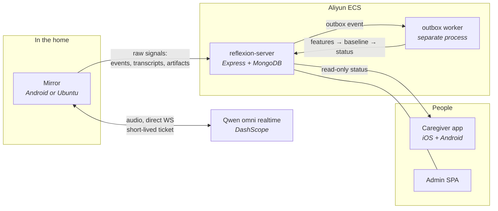

# Reflexion

A daily reassurance companion for elderly people living at home, built for Singapore.

A smart mirror in the hallway runs a short spoken check-in each morning — "Aria" asks how they slept, whether they've eaten, whether they've taken their medication. A backend turns that conversation into a deterministic status. A caregiver app answers one question, in warm plain language: **is Mum okay today?**

> ### Not a diagnostic tool
>
> Reflexion never shows a cognitive score, a risk percentage, or clinical wording to a family. Longitudinal signals are computed and stored server-side for research, but what a caregiver sees is one of four reassurance states and a sentence explaining it. This is a product boundary, not a UI preference — treat it as a constraint when changing anything user-facing.

## How it fits together

Data flows **one way**. The mirror never computes status; the caregiver app never recomputes it.



The status engine produces exactly four states: `establishing`, `doing_well`, `worth_checking`, `needs_attention`.

**The consequence people trip over:** a finished check-in sits in `ingesting` until the outbox worker runs. `reflexion-worker` is a long-lived process, never work done inside a request. If you are testing and status never changes, run `node dist/jobs/outboxWorker.js --once`.

## Packages

No root `package.json`, no workspaces, no Makefile. **Run every command from inside the package directory.**

| Package | What it is |
|---|---|
| [`reflexion-server/`](reflexion-server/) | The single backend for every client. Express + TypeScript ESM + the raw MongoDB driver (no ODM). One `tsc` build serves three processes: HTTP API, outbox worker, scheduled jobs. |
| [`mirror-app/`](mirror-app/) | The mirror itself — one Expo/React Native codebase shipping to **two** platforms: an Android APK and an Ubuntu AppImage ([`docs/mirror-app/linux-electron.md`](docs/mirror-app/linux-electron.md)). Also holds the local wake-word training pipeline. |
| [`caregiver-app/`](caregiver-app/) | The family-facing Expo app, iOS + Android. |
| [`admin-web/`](admin-web/) | Operator SPA (onboarding, users, support threads). Vite + React, v1 API only. |
| [`caregiver-web/`](caregiver-web/) | A single-file static prototype of the caregiver UI. No build step, not wired to the backend — a design reference. |
| [`hardware/SoundRecorder/`](hardware/SoundRecorder/) | Stock, unmodified AOSP `com.android.soundrecorder`, vendored for reference. Compiled into the device system image by the platform build, **not** by anything here — and **not** the check-in capture path. |
| [`_archived/`](_archived/) | The superseded Python clinic platform. Dead code, reference only. |

## Getting started

Node **24.x** (`.nvmrc` pins `24.18.0`). Not optional: the server's pinned `geoip-lite` needs Node 24 or newer, and production runs the same line.

```bash
nvm use                       # 24.18.0
```

### Backend

```bash
cd reflexion-server
npm ci
cp .env.example .env          # then fill it in — see below
npm run dev                   # tsx watch on :3001
npm run dev:worker            # SEPARATE terminal — nothing gets a status without this
npm test                      # node:test + mongodb-memory-server, no external Mongo needed
```

**MongoDB must be a replica set** (single-node is fine locally). Pairing claim, credential exchange and session completion all use multi-document transactions, which standalone `mongod` rejects.

Three secrets must each be **≥32 characters** or the server throws at startup: `JWT_SECRET`, `PAIRING_PEPPER`, `CREDENTIAL_ENCRYPTION_KEY`.

### Mirror

```bash
cd mirror-app
npm install
npm run web                   # browser dev; open /realtime-test to exercise the voice pipeline
npm run android               # native build — required for PCM audio, wake word, direct WS
npm run electron:build        # Ubuntu AppImage
```

### Caregiver app

```bash
cd caregiver-app
npm install                   # the postinstall patch is required — it fixes which activity expo launches
npm run dev
```

### Admin SPA

```bash
cd admin-web
VITE_DEV_API_TARGET=http://localhost:3001 npm run dev    # :5174
```

`VITE_DEV_API_TARGET` must be a **shell** variable — `vite.config.ts` reads `process.env`, so a `.env` file will not reach it.

## Devices

A mirror holds **no provider keys**. Identity is a three-step chain:

1. **bootstrap token** — per-device, minted by `npm run provision:device` on the machine that owns the database. Sent in the `X-Device-Bootstrap` header.
2. **device credential** — obtained by pairing (6-digit code claimed by a caregiver), then rotated.
3. **Qwen realtime ticket** — short-lived, minted per conversation.

A bootstrap token is **device-bound**: the backend re-reads the device row by `(did, serialHash)` on every call. So a token is only valid against the database and `JWT_SECRET` that created it — one minted on a laptop will 401 in production — and **it must never be shared between units**, or they claim the same identity and knock each other's pairing over.

## Docs

- **[`docs/ARCHITECTURE-AND-API.md`](docs/ARCHITECTURE-AND-API.md)** — the canonical reference. Every endpoint, every flow, the full collection map, deployment topology. Start here.
- [`docs/reflexion-implementation-baseline.md`](docs/reflexion-implementation-baseline.md) — frozen decisions and the mirror→backend upload contract.
- [`docs/operations/`](docs/operations/) — deploy runbook, runtime compatibility.
- [`docs/mirror-app/`](docs/mirror-app/) — the two conversations, device provisioning, OTA, the Linux build, network setup.
- [`CLAUDE.md`](CLAUDE.md) — the working notes: conventions, and the specific things that have bitten us.

## Testing and checks

There is **no CI, no linter and no formatter**. The only static check is `npm run typecheck` (`tsc --noEmit`); `caregiver-app` has no such script, so use `npx tsc --noEmit` there. Do not invent `npm run lint`.

The release-order gate, from the runbook:

```
npm ci → typecheck → test → coverage → build → db:indexes
```

## Conventions

Conventional Commits with a package scope (`fix(mirror-app): …`, `feat(admin-web): …`). Branches `type/short-kebab-description`, merged to `main` through pull requests. Chinese in commit subjects is normal.

Every package's `.env` is gitignored and `.env.example` is the template. The production backend `.env` exists **only on the production server** and has been lost once — never overwrite it wholesale.
