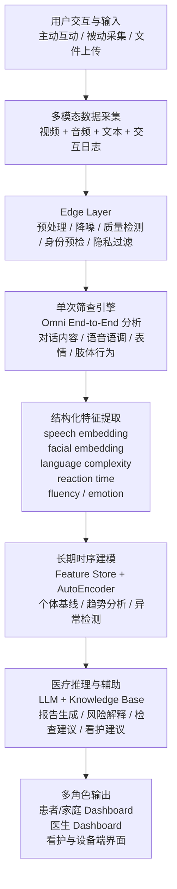
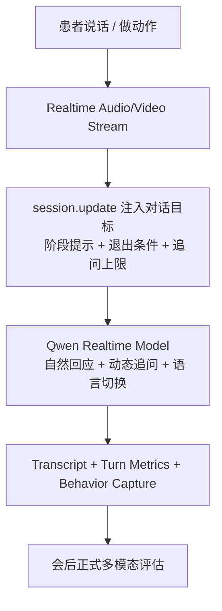

# 基于多模态感知、长期时序建模与实时交互的无接触认知障碍早筛 Pipeline

## 一句话概述

我们构建了一个分层式、多模态、可长期追踪的认知障碍早筛系统：在家庭或诊所场景中采集患者的视频、语音、文本和交互行为，先完成单次风险筛查，再基于长期特征变化进行异常检测，最终将结果和建议同步给医生、患者和看护人员。

---

## 三个核心卖点

- **多模态**：同时理解视频、语音、文本和交互日志，而不是只依赖问卷或单一模态。
- **时间维度**：不仅输出单次筛查结果，更为每位患者建立长期个体化基线，监测认知变化趋势。
- **分层架构**：Edge 侧负责预处理、身份校验和隐私控制，中间层负责多模态感知，云端负责长期建模、报告生成和医疗辅助。

---

## 端到端 Pipeline



---

## 分层说明

### 1. 用户交互与输入层

系统支持三类入口：

- **主动互动**：AI Agent 通过语音和视频引导老人完成记忆、语言、逻辑和情绪相关任务。
- **被动采集**：镜子或摄像头设备在日常环境中进行非侵入式观察。
- **文件上传**：支持历史视频、音频或多模态文件离线诊断。

输入统一包括：

- Video：面部、动作、姿态
- Audio：语音内容、语调、停顿、流利度
- Text：ASR 转写文本
- Interaction Logs：答题记录、反应时间、交互事件

### 2. Edge Layer

设备侧负责轻量但关键的前处理：

- 数据质量检查
- 降噪和标准化
- 本地轻量过滤
- 身份预检
- 隐私控制

这一层的目标是减少无效上传、提升实时交互稳定性，并在数据离开设备前先完成最基础的安全与质量门控。

### 3. 单次筛查引擎

每次交互结束后，系统使用全模态 Omni 模型对完整会话进行端到端分析，综合理解：

- 对话内容
- 语音语调与流利度
- 面部表情
- 肢体与动作
- 行为反应

输出包括：

- 单次认知评分
- 风险分类
- 结构化会话摘要

### 4. 特征提取层

系统不会只保留一次性的最终分数，而是把每次会话编码成长期可追踪的特征向量，例如：

- speech embedding
- facial embedding
- language complexity score
- reaction time
- fluency
- emotion level

### 5. 长期时序建模层

这是系统的核心竞争力。

我们不只做单次筛查，而是为每位患者建立长期认知轨迹。系统不保存原始视频，仅保留匿名化或低可逆性的结构化特征表示，用于长期风险分析。

```text
Feature Vector
   ↓
Encoder
   ↓
Latent Space
   ↓
Decoder
   ↓
Reconstruction Error
   ↓
Anomaly Score
```

输出包括：

- 认知下降趋势图
- 个体基线偏移
- 异常告警与早期预警

### 6. 医疗辅助层

在得到单次风险与长期趋势后，系统通过 LLM + Knowledge Base 生成面向不同角色的可解释输出。

医生侧：

- 自动报告生成
- 推荐进一步检查建议
- 历史趋势分析
- 多患者风险排序

看护侧：

- 日常照护建议
- 多语言沟通建议
- 训练与干预任务建议

### 7. 多角色系统

最终输出到三个界面：

- 患者/家庭 Dashboard：实时评分、趋势变化、日常建议
- 医生 Dashboard：多患者管理、风险排序、报告导出
- 设备端界面：镜子或终端上的语音引导与交互流程

---

## 身份验证：如何确认“就是本人”

身份层不是一句泛泛的“做人脸识别”，而是一个**开场预检 + 会后归档 + 时序门控**的闭环。

### 1. 双重保障机制

我们在身份核验上强调“双重保障”：

#### 第一重保障：多帧主人脸检测与质量门控

系统不会拿单帧图片直接做一次性判断，而是先对开场若干帧进行筛选，确认：

- 画面里是否有稳定、清晰、可用的人脸
- 是否能持续锁定同一个主人脸
- 人脸是否足够大、足够居中、跨帧连续性是否足够好

只有通过这一层质量门控，系统才会进入正式的身份比对流程。这样可以先排除：

- 光线过暗
- 镜头里多人同时出现
- 患者没有正对设备
- 运动过大导致的人脸不稳定

#### 第二重保障：Face Embedding 相似度验证

在通过质量门控后，系统会提取当前会话的人脸 embedding，并与患者档案中的 canonical face embedding 做相似度匹配。

这一层才是真正意义上的“是不是本人”的身份验证。

也就是说，我们不是只做检测，也不是只做比对，而是：

```text
先确认这张脸是否稳定可信
          ↓
再确认这张脸是否属于该患者
```

### 2. 首次建档与注册

- 为每位患者建立唯一 patient ID
- 在首次可信会话中提取多帧人脸特征，生成 canonical face embedding
- 将该 embedding 与患者档案绑定，形成后续会话的参考模板

这里可以同时包含两种实现路径：

#### 当前原型实现

当前原型采用多帧人脸描述子方案：

- 先检测并选择主人脸
- 对人脸 crop 做标准化
- 提取 HOG、LBP、低分辨率人脸强度图、边缘投影等特征
- 将这些特征拼接并归一化，形成 face embedding
- 对多帧 embedding 求平均，得到该患者的初始模板

这是一个传统视觉特征驱动的 face-embedding pipeline，优点是轻量、透明、易于快速验证原型。

#### 生产级实现

在正式产品中，我们会接入 CNN-based face encoder，例如 ArcFace / FaceNet / InsightFace 一类方案：

- 对多帧高质量人脸做检测和对齐
- 通过 CNN encoder 输出每帧 embedding
- 对多帧 embedding 求平均并做 L2 normalization
- 得到患者的 canonical identity template

公式上可以写成：

```text
e_i = FaceEncoder(aligned_face_i)
e_patient = Normalize(mean(e_1, e_2, ..., e_n))
score = cosine(e_current, e_patient)
```

对外汇报时，你可以把这两者统一表述为：

> 我们通过多帧人脸编码建立患者的身份模板，并在后续会话中进行相似度验证；原型阶段采用轻量的人脸描述子方案，产品化阶段可升级为 CNN-based face encoder。

### 3. 会话开始前的人脸预检

在 realtime 会话真正开始前，系统会先读取开场几帧图像：

- 检测是否存在稳定、清晰、可用的人脸
- 提取当前会话的人脸 embedding
- 与已注册模板做相似度匹配

根据匹配结果，系统分为四类：

- `verified`：确认是本人，允许开始
- `needs-retry`：人脸质量不足，要求调整站位、光线或重新采集
- `mismatch`：疑似不是本人，阻止进入正式流程
- `unenrolled`：尚未建档，允许在确认后建立首个身份模板

### 4. 会话结束后的身份归档

正式会话结束后，系统会再次进行会话级身份归因：

- 结合人脸特征
- 结合说话人结构和患者是否持续在画面中
- 结合语言/语音风格等辅助信号

然后对该次会话给出：

- `include`：允许写入该患者长期时间线
- `manual-review`：进入人工复核
- `exclude`：不写入患者档案

### 5. 为什么这一步很重要

这意味着：

- 家属误入镜头不会污染患者历史轨迹
- 陪护人员代答不会轻易写入患者长期模型
- 身份不确定的会话不会参与长期异常检测

也就是说，**身份置信度是长期建模的硬门控条件之一**。

### 6. 技术实现

> 我们采用双重身份保障机制：第一重是多帧主人脸检测与质量门控，先确保采集到的是稳定可信的人脸；第二重是基于 face embedding 的本人验证，将当前会话与患者档案中的身份模板做相似度匹配。只有通过身份门控的会话才会进入长期认知档案和异常检测流程。

这是一个双层 identity pipeline。第一层是 multi-frame face quality gating，用于主人脸选择和稳定性判断；第二层是 face-embedding-based verification，用于模板匹配和身份确认。生产环境可接入 CNN-based face encoder，当前原型已具备多帧采样、主人脸选择、传统视觉描述子 embedding、相似度阈值分流、重试/人工复核/排除等完整决策逻辑。

---

## Realtime 对话：如何做到自然，而不是硬编码

我们的实时交互不是把一串固定问题写死在前端，而是把**阶段目标、退出条件和追问上限**交给 realtime 模型动态执行。

### 1. 不是死脚本，而是“目标驱动的对话编排”

每个阶段只定义：

- 本阶段要获取什么信息
- 首个引导问题是什么
- 在什么条件下可以进入下一阶段
- 最多允许多少次追问

例如：

- Orientation：确认姓名、地点、自我定向
- Recent Story：引导其讲述当天经历，观察叙事连贯性
- Daily Function：观察是否依赖提醒、监督或照护
- Delayed Recall：在会话末尾做延迟回忆

模型不是机械重复这些句子，而是根据患者回答自然接续、简短确认、必要时追问，然后自动进入下一阶段。

### 2. Realtime 模型负责“引导与互动”，不是当场诊断

实时模型的职责是：

- 自然地和患者说话
- 控制节奏，减少考试感
- 根据上下文做简短确认和追问
- 采集高质量的语音、视频和反应数据

它**不会在对话当场给出痴呆概率或医疗结论**。正式打分和风险分类仍然在会后由单次筛查引擎完成。

### 3. 为什么它比硬编码更自然

因为我们把“如何说”交给模型，而不是把每一句答复预先写死：

- 可以根据患者的停顿、困惑和语言切换自动调整回应
- 可以做简短复述和确认，减少生硬感
- 可以在不打断自然对话的前提下完成标准化任务

### 4. 实时交互的技术路径



在实现上，我们通过 realtime API 的 `session.update` 注入会话说明和阶段规则，并启用 `server_vad` 做实时语音活动检测，从而让模型更像在自然对话，而不是“等按钮、问固定题、播固定词”。

---

## 多语言与方言支持

> 系统支持 70+ 种语言与方言的认知筛查与交互，包括英语、中文、马来语，以及粤语、香港粤语、福建话/闽南语等方言理解。

结合 Qwen 官方文档，可以更精确地说明：

- **Qwen3.5-Omni** 官方输入覆盖 **113 种语言与方言**，其中明确包含中文、英语、马来语、粤语、香港粤语、福建话、闽南语等
- **Qwen3.5-Omni** 官方输出音频覆盖 **36 种语言与方言**
- **Qwen3-Omni-Flash** 官方输入/输出覆盖 **19 种常见语言与方言**，其中包含粤语和闽南语
- **Qwen 实时 ASR** 官方支持的输入语言中包含普通话、四川话、闽南语、吴语、粤语，以及马来语等多语言

因此，我们的系统级多语言能力可以通过模型路由来实现：

- 实时交互层：选择合适的 realtime / ASR 模型完成自然多语种输入理解
- 正式单次评估层：用全模态 Omni 模型完成高质量诊断分析
- 文本理解与报告层：用 LLM 做多语言摘要、解释和建议生成

这意味着我们不是只支持“翻译”，而是支持：

- 多语言问答
- 多语言认知任务引导
- 方言级语音理解
- 多语言报告和照护建议生成

---

## TalkBank 数据覆盖与当前基线结果

### 1. TalkBank 当前覆盖情况

- 当前整理到的 TalkBank 数据覆盖 **7 个语言**：English, German, Greek, Korean, Mandarin, Spanish, Taiwanese
- 共覆盖 **21 个 corpora**
- 共计 **6162 个 leaf files**

### 2. 当前已下载并使用的数据子集

| 语言 / Corpus | 数量 |
|---|---:|
| English / Lu | 54 |
| English / Pitt | 1290 |
| Korean / Kang | 77 |
| Mandarin / Chou | 261 |
| Spanish / Ivanova | 358 |
| **合计** | **2040** |

### 3. 数据质量观察

- 当前数据中存在较多音频质量不佳的样本
- 有不少片段中对话者语音较难听清，这会直接影响转写、说话人识别和后续多模态判断
- 因此，当前结果更适合作为在真实噪声条件下的阶段性基线，而不是理想录音环境下的上限表现

### 4. 当前基线指标

| 指标 | 数值 |
|---|---:|
| accuracy | 0.74 |
| precision | 0.7308 |
| recall | 0.76 |
| specificity | 0.72 |
| F1 | 0.7451 |

---

## 降级方案 Fallback

真实环境中不可能总是拿到完整的音视频，因此系统提供降级路径：

| 场景 | 路由 | 说明 |
|---|---|---|
| 无视频 | ASR + LLM | 仅基于语音转写与语言特征做分析 |
| 无语音 | Vision-only Model | 基于表情、动作与视觉行为做分析 |
| 文件上传 | Multimodal Batch Inference | 对历史多模态文件做离线批量评估 |

---

## 汇报时建议重点强调的表述

### 版本一：简洁版

我们的方案不是一次性问卷，而是一个“实时引导 + 单次筛查 + 长期监测”的多模态认知早筛系统。  
它能够在家庭或诊所环境中，通过视频、语音、文本和交互行为捕捉认知风险，并通过长期特征变化实现更早期的异常检测。

### 版本二：强调差异化

与传统单次筛查不同，我们的核心价值不只是做一次打分，而是为每位患者建立长期个体化基线。  
同时，我们引入本人验证机制，保证只有通过身份门控的会话才进入个人档案；再结合 realtime 模型的自然对话能力，使筛查过程更像真实交流，而不是僵硬的固定问答。

### 版本三：技术型表达

这是一个 layered multimodal pipeline：  
Edge 层负责预处理、身份预检与隐私控制；  
Omni 层负责单次会话的全模态 end-to-end 评估；  
Temporal 层基于特征库和 AutoEncoder 做长期异常检测；  
LLM + Knowledge Base 层负责临床解释、报告生成和看护建议。

---

## 参考资料

- [Qwen-Omni 官方模型说明](https://help.aliyun.com/zh/model-studio/qwen-omni)
- [Qwen-Omni Realtime 官方说明](https://help.aliyun.com/zh/model-studio/realtime)
- [Qwen-Omni Realtime 客户端事件 `session.update`](https://help.aliyun.com/zh/model-studio/client-events)
- [实时多模态交互流程与 `server_vad`](https://help.aliyun.com/model-studio/omni-realtime-interaction-process)
- [Qwen 实时 ASR 官方说明](https://help.aliyun.com/zh/model-studio/qwen-real-time-speech-recognition)
