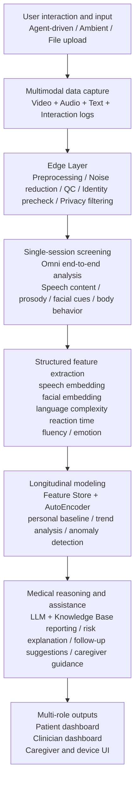
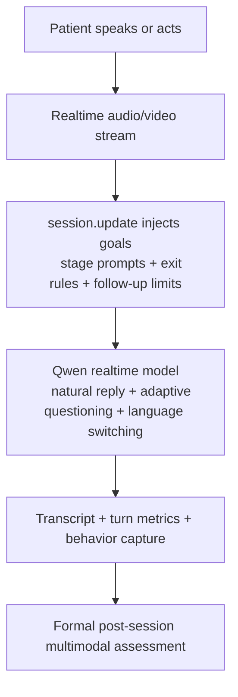

# Contactless Cognitive Screening Pipeline with Multimodal Perception, Longitudinal Modeling, and Realtime Interaction

## One-Line Summary

We are building a layered, multimodal, longitudinal cognitive screening system that captures video, audio, text, and interaction behavior in home or clinic settings, performs single-session risk screening, tracks long-term change over time, and delivers interpretable outputs to clinicians, patients, and caregivers.

---

## Three Core Differentiators

- **Multimodal**: We jointly analyze video, speech, text, and interaction logs instead of relying on questionnaires or a single signal.
- **Temporal**: We do not stop at one screening result; we build a per-patient baseline and monitor cognitive drift over time.
- **Layered architecture**: The Edge layer handles preprocessing, identity checks, and privacy controls; the perception layer handles multimodal understanding; the cloud layer handles longitudinal modeling, reporting, and medical assistance.

---

## End-to-End Pipeline



---

## Layer-by-Layer Explanation

### 1. User interaction and input layer

The system supports three entry modes:

- **Agent-driven interaction**: an AI agent guides the patient through memory, language, reasoning, and affect-related tasks using voice and video.
- **Ambient capture**: a mirror or camera device observes everyday behavior non-invasively in the home.
- **File upload**: recorded videos, audio files, or multimodal files can be screened offline.

Unified inputs include:

- Video: face, pose, movement, gesture
- Audio: speech content, prosody, hesitation, fluency
- Text: ASR transcripts
- Interaction logs: answers, response latency, events

### 2. Edge layer

The device-side layer performs lightweight but critical work:

- quality checks
- denoising and normalization
- local filtering
- identity prechecks
- privacy controls

Its job is to reduce bad uploads, stabilize realtime interaction, and gate low-quality or unsafe inputs before data leaves the device.

### 3. Single-session screening layer

For each completed interaction, the system uses an omni model to analyze the full session end to end across:

- dialogue content
- speech prosody and fluency
- facial expression
- body movement
- behavioral response

Outputs include:

- single-session cognitive score
- risk classification
- structured session summary

### 4. Feature extraction layer

We do not retain only a final score. Each session is encoded into a reusable feature vector, such as:

- speech embedding
- facial embedding
- language complexity score
- reaction time
- fluency
- emotion level

### 5. Longitudinal modeling layer

This is the core moat of the system.

We do not rely on one session alone. Instead, we build a longitudinal trajectory for each patient. The system does not need to store raw video for this stage; it stores structured, lower-risk features for long-term analysis.

```text
Feature Vector
   ↓
Encoder
   ↓
Latent Space
   ↓
Decoder
   ↓
Reconstruction Error
   ↓
Anomaly Score
```

Outputs include:

- cognitive decline trend curves
- baseline deviation signals
- anomaly alerts and early warnings

### 6. Medical assistance layer

After combining single-session outputs with longitudinal signals, the system uses an LLM plus a knowledge base to generate interpretable outputs.

For clinicians:

- automated reports
- suggested next-step examinations
- longitudinal trend summaries
- multi-patient risk prioritization

For caregivers:

- care recommendations
- multilingual communication guidance
- suggested cognitive or behavioral exercises

### 7. Multi-role surfaces

The final outputs feed three surfaces:

- patient/family dashboard: scores, trends, and daily suggestions
- clinician dashboard: patient management, prioritization, and report export
- device UI: mirror or terminal-based guided interaction

---

## Identity Verification: How We Confirm It Is the Right Person

The identity layer is not a generic “we do face recognition” statement. It is a closed-loop **pre-session verification + post-session linkage + longitudinal gating** design.

### 1. Two-layer identity assurance

We describe the identity stack as a **two-layer assurance mechanism**.

#### First layer: multi-frame primary-face detection and quality gating

The system does not trust a single frame. It first inspects several opening frames to confirm:

- a stable and usable face is visible
- the same primary face can be tracked across frames
- the face is large enough, centered enough, and temporally stable enough

Only after this quality gate passes do we proceed to identity matching. This filters out cases such as:

- poor lighting
- multiple people in the frame
- the patient not facing the device
- unstable motion or blur

#### Second layer: face embedding similarity verification

Once the capture quality is acceptable, the system extracts a face embedding for the current session and compares it with the patient’s canonical face embedding stored in the profile.

This is the actual “is this the right person?” verification step.

So the logic is:

```text
first verify that the captured face is stable and trustworthy
                           ↓
then verify that the face belongs to the enrolled patient
```

### 2. Enrollment

- each patient gets a unique patient ID
- a trusted initial session is used to extract multiple face samples
- these samples are encoded into a canonical face embedding tied to that patient profile

This can be implemented in two forms:

#### Current prototype implementation

The current prototype uses a multi-frame classical face descriptor pipeline:

- detect and select the primary face
- normalize the face crop
- extract HOG, LBP, low-resolution face intensity, and edge-projection features
- concatenate and normalize them into a face embedding
- average embeddings across multiple frames to create the initial patient template

This is a lightweight, interpretable face-embedding approach suitable for prototyping.

#### Production-grade implementation

For a product-grade deployment, we can plug in a CNN-based face encoder such as ArcFace, FaceNet, or InsightFace:

- detect and align multiple high-quality face frames
- run a CNN face encoder on each aligned face
- average the embeddings and apply L2 normalization
- store the result as the patient’s canonical identity template

In formula form:

```text
e_i = FaceEncoder(aligned_face_i)
e_patient = Normalize(mean(e_1, e_2, ..., e_n))
score = cosine(e_current, e_patient)
```

For external reporting, both can be summarized as:

> We build a patient identity template from multiple face samples and verify future sessions against that template. The prototype uses a lightweight face-descriptor pipeline, while the product path upgrades to a CNN-based face encoder.

### 3. Opening-face precheck before the realtime session

Before the realtime session formally starts, the system inspects the opening camera frames:

- verify that a stable, usable face is visible
- extract the current-session face embedding
- compare it against the enrolled patient template

The system then routes the session into one of four outcomes:

- `verified`: identity is strong enough to proceed
- `needs-retry`: face quality is insufficient, so the user is asked to adjust position or lighting
- `mismatch`: likely not the enrolled patient, so the session is blocked
- `unenrolled`: no template exists yet, so the session may proceed to create the initial enrollment

### 4. Post-session identity linkage

After the formal session, identity attribution is evaluated again using:

- face features
- whether the patient remained the primary visible person
- speaker structure and conversational participation
- auxiliary voice or language-style signals

Each session is then marked as:

- `include`: safe to write into the patient timeline
- `manual-review`: hold for human review
- `exclude`: do not write into the patient record

### 5. Why this matters

This prevents:

- family members from contaminating the patient timeline
- caregivers answering on behalf of the patient from being silently accepted
- uncertain sessions from polluting longitudinal anomaly detection

In other words, **identity confidence is a hard gate for longitudinal modeling**.

### 6. explanation

> We use a two-layer identity assurance mechanism. The first layer verifies that a stable primary face has been captured, and the second layer verifies that the captured face matches the patient’s enrolled identity template. Only identity-approved sessions are allowed into the patient’s longitudinal profile.

This is a two-layer identity pipeline. The first layer is multi-frame face quality gating for primary-face selection and stability checks. The second layer is face-embedding-based verification for template matching and patient confirmation. A production deployment can use a CNN-based face encoder, while the current prototype already implements multi-frame sampling, primary-face selection, classical visual descriptor embeddings, threshold-based routing, retry/manual review/exclusion logic, and longitudinal identity gating.

---

## Realtime Conversation: Natural Guidance Instead of Hardcoded Dialogue

Our realtime interaction should feel like a short human conversation first, with the required probes woven into it quietly in the background. The system therefore uses a **goal-driven conversation plan with hidden objectives**, not a patient-facing script.

### 1. The system defines hidden goals, not lines to recite

For each stage, we define:

- what signal needs to be collected
- a natural way to enter that topic
- when the stage can end
- how many gentle follow-ups are allowed

Example hidden stages:

- Orientation
- Recent Story
- Daily Function
- Wrap-up Recall

The patient should never hear those stage labels. The model uses them internally to stay on track while the conversation sounds normal.

### 2. Specific questions are blended into natural conversation

The design goal is not “ask question 1, then question 2.” It is:

- acknowledge what the patient just said
- bridge naturally into the next topic
- ask one thing at a time
- keep the structure invisible to the patient

For example, instead of a blunt scripted jump, the guide can say:

> “Thanks, Tony. I'd like to hear a little about how your day has been going. How has your day been so far?”

This keeps the conversation human while still collecting structured cues in a clinically useful way.

### 3. The realtime model guides, but does not diagnose live

Its role is to:

- interact naturally with the patient
- reduce the feeling of being tested
- adapt phrasing and language in real time
- capture high-quality audio, video, and behavioral signals

It does **not** deliver a live dementia judgment, risk probability, or diagnostic conclusion. Formal scoring happens after the session in the post-session screening pipeline.

### 4. Why this feels more human than hardcoded logic

Because the phrasing is delegated to the realtime model under clear style rules:

- it can sound warm instead of robotic
- it can use the patient’s name naturally once known
- it can respond to hesitation without breaking flow
- it can switch language when the patient does
- it still stays inside a structured, auditable screening design

### 5. Technical path for realtime guidance



Implementation-wise, the conversation plan is injected through the realtime API via `session.update`, but the instructions explicitly tell the model to treat the stage plan as hidden guidance rather than patient-facing dialogue. `server_vad` is used for turn detection so the interaction feels conversational rather than button-based or script-replay based.

---

## Multilingual and Dialect Support

> The system supports cognitive screening and interaction across 70+ languages and dialects, including English, Chinese, Malay, Cantonese, Hong Kong Cantonese, and Fujianese/Minnan/Hokkien understanding.

Based on Qwen’s official documentation:

- **Qwen3.5-Omni** supports **113 input languages and dialects**, explicitly including Chinese, English, Malay, Cantonese, Hong Kong Cantonese, Fujianese, and Minnan
- **Qwen3.5-Omni** supports **36 spoken output languages and dialects**
- **Qwen3-Omni-Flash** supports **19 common input/output languages and dialects**, including Cantonese and Minnan
- **Qwen realtime ASR** supports multilingual input including Mandarin, Sichuan dialect, Minnan, Wu, Cantonese, Malay, and many other languages

This means our system-level multilingual capability comes from model routing:

- the realtime layer can use the appropriate realtime and ASR path for live multilingual intake
- the formal assessment layer can use a stronger omni model for full multimodal diagnosis
- the reasoning layer can generate multilingual summaries, reports, and caregiver guidance

So we are not just “translating” content. We support:

- multilingual interaction
- multilingual cognitive task guidance
- dialect-level speech understanding
- multilingual reports and care recommendations

---

## TalkBank Coverage and Current Baseline Results

### 1. Current TalkBank coverage

- The current TalkBank dataset scope covers **7 languages**: English, German, Greek, Korean, Mandarin, Spanish, and Taiwanese
- It spans **21 corpora**
- It includes **6162 leaf files**

### 2. Downloaded and currently used subset

| Language / Corpus | Count |
|---|---:|
| English / Lu | 54 |
| English / Pitt | 1290 |
| Korean / Kang | 77 |
| Mandarin / Chou | 261 |
| Spanish / Ivanova | 358 |
| **Total** | **2040** |

### 3. Data quality observations

- A meaningful portion of the current data has poor audio quality
- In many segments, the speaker is difficult to hear clearly, which directly affects transcription, speaker analysis, and downstream multimodal judgment
- The current results should therefore be interpreted as a practical baseline under noisy real-world conditions rather than an upper bound from clean recordings

### 4. Current baseline metrics

| Metric | Value |
|---|---:|
| accuracy | 0.74 |
| precision | 0.7308 |
| recall | 0.76 |
| specificity | 0.72 |
| F1 | 0.7451 |

---

## Fallback Design

Real-world deployment will not always have perfect video and audio, so the system supports graceful degradation:

| Scenario | Route | Notes |
|---|---|---|
| No video | ASR + LLM | analysis based on transcript and speech-language features |
| No audio | Vision-only model | analysis based on facial and behavioral visual cues |
| File upload | Multimodal batch inference | offline processing of recorded multimodal files |

---

## References

- [Qwen-Omni official model documentation](https://help.aliyun.com/zh/model-studio/qwen-omni)
- [Qwen-Omni Realtime official documentation](https://help.aliyun.com/zh/model-studio/realtime)
- [Qwen-Omni Realtime client events and `session.update`](https://help.aliyun.com/zh/model-studio/client-events)
- [Realtime multimodal interaction flow and `server_vad`](https://help.aliyun.com/model-studio/omni-realtime-interaction-process)
- [Qwen realtime ASR official documentation](https://help.aliyun.com/zh/model-studio/qwen-real-time-speech-recognition)
