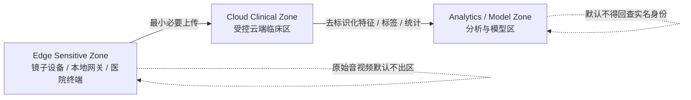

# 认知早筛系统隐私保护与安全分区设计

## 一句话原则

不是把所有患者数据集中进一个“中央数据库”，而是按**敏感度、用途和访问角色**拆成三层：`Edge Sensitive Zone`、`Cloud Clinical Zone`、`Analytics / Model Zone`。  
真正提升安全性和隐私保护的关键，是把**加密**和**最小必要、默认不上传原始数据、分区隔离、去标识化、强审批、强审计、短期留存、可追责删除**一起设计，而不是只做其中一项。

---

## 适用范围与说明

- 本文面向我们的认知障碍早筛系统，包括镜子设备、本地网关、医院终端、云端临床服务、模型训练与分析环境。
- 本文同时覆盖加密、传输保护，以及**除加密之外**如何通过系统设计提升安全性和隐私保护。
- 截至 **2026-04-11**，HHS/OCR 官网仍将 **2024-12-27** 发布的 HIPAA Security Rule 更新列为 **proposed rule**，因此本文以**当前生效的 HIPAA Security Rule 与 Privacy Rule 官方指导**为底线，并参考其强化方向进行架构设计。[1][5]
- 本文是技术与治理设计说明，不替代正式法律意见或 HIPAA 合规法律审查。

---

## 设计目标

根据 HHS/OCR 当前生效的 HIPAA Security Rule，ePHI 的保护目标不只是“防泄露”，还包括三件事同时成立：[1]

- **保密性 Confidentiality**：未授权的人或进程不能接触到数据
- **完整性 Integrity**：数据和结果不能被未授权篡改或损坏
- **可用性 Availability**：授权人员在需要时必须能访问并使用数据

同时，HIPAA Privacy Rule 强调 **minimum necessary** 原则，也就是对 PHI 的使用、披露和请求都应限制在完成目标所必需的最小范围内。[2]

这意味着我们的系统设计目标不是“把所有东西都先存起来，以后再说”，而是：

- 原始音视频默认停留在边缘侧
- 云端临床区只保存诊断和长期追踪所需的最小必要数据
- 分析与模型区默认只拿到去标识化后的特征、标签和统计结果
- 任何跨区访问都需要有**明确目的、明确授权、明确留存期限、明确审计**

---

## 三层分离架构

三层分离的核心价值是：

- 就算分析区发生误配置、账号泄露或研究数据外流，也不应该直接暴露患者实名视频、原始音频或完整身份信息
- 临床区即使持有患者主索引，也不应该把训练、评估、统计分析和研究访问混在一起
- 边缘设备即使暂时处理最敏感原始流，也不应长期保存，更不应把原始内容默认上传到中心系统

---

## 加密与 PQC 传输

### 1. 先说结论

- **静态数据加密必须做**
- **传输加密必须做**
- **传输链路中的公钥密码部分应尽快迁移到 PQC，过渡期优先采用 hybrid PQC**

这里要特别区分两类问题：

- **数据静态加密**主要依赖对称密码，不需要把所有存储都改成“PQC 算法”
- **量子风险最大的是公钥密码部分**，也就是密钥交换、密钥封装、数字签名、证书链和部分密钥包装流程

换句话说，工程上更准确的做法不是“所有加密都换成 PQC”，而是：

- 静态数据继续使用强对称加密
- 传输和密钥协商优先切到 PQC 或 hybrid PQC
- 签名、软件供应链和关键对象完整性逐步迁移到 NIST 标准化的 PQC 签名体系

### 2. 静态数据加密

建议原则：

- 云端对象存储、数据库、备份、日志归档、边缘临时缓存都应启用默认静态加密
- 优先采用 **AES-256** 等高强度对称加密方案
- 存储层尽量采用 **envelope encryption**：数据用数据密钥加密，数据密钥再由 KMS / HSM 保护
- 不同 zone、不同数据类型、不同环境使用分离的密钥层级，不共享一个“万能主密钥”

建议落地：

- **Edge Sensitive Zone**：设备磁盘、缓存分区、离线队列、崩溃转储文件加密；设备丢失时应尽量降低可恢复性
- **Cloud Clinical Zone**：数据库、对象存储、备份、搜索索引、报表导出落盘文件全部加密
- **Analytics / Model Zone**：训练特征、实验缓存、向量索引、评估结果、导出工件全部加密

密钥管理上应再加几条硬规则：

- KMS / HSM 托管主密钥，不在应用配置里硬编码
- 定期轮换密钥，并支持按患者批次、按环境、按数据域吊销
- 生产、测试、研究环境密钥绝对分离
- 原始片段例外上传若发生，应使用更短 TTL 和更高保护等级的专用密钥域

### 3. 传输加密

建议原则：

- 所有设备到网关、设备到云端、服务到服务、后台到存储、后台到模型服务的链路都必须使用传输层加密
- 默认使用 **TLS 1.3**
- 内部服务之间优先启用 **mTLS**
- 不允许明文 HTTP、明文 WebSocket、明文 gRPC 或未鉴权的内部回传链路

### 4. 传输链路使用 PQC

根据 NIST 当前正式标准，**FIPS 203（ML-KEM）** 已在 **2024-08-13** 正式发布，用于公钥密钥建立；**FIPS 204（ML-DSA）** 与 **FIPS 205（SLH-DSA）** 也已正式发布，用于数字签名。[6][7]  
因此，面向未来量子风险的迁移方向应明确写成：

- **传输密钥协商优先迁移到 ML-KEM 体系**
- **迁移期优先使用 hybrid PQC**，即传统 ECDHE 与 ML-KEM 组合，而不是“一步到位强制纯 PQC”
- **设备、网关、临床云、API 网关、service mesh、反向代理、KMS 集成点**都应具备 crypto agility，便于后续平滑切换

这里的原因是：

- 现实部署里，互操作性、硬件加速、证书生态、合规验证和第三方产品支持还在持续演进
- 截至 **2026-04-11**，IETF TLS 工作组已经有针对 **TLS 1.3 hybrid ECDHE-MLKEM** 的活跃标准化草案，但仍属于草案而非最终 RFC，因此工程上更适合采用“**hybrid-first, crypto-agile**”策略，而不是写死成某一个永久不变的实现细节。[9]

更具体一点，文档里可以这样规定：

- 外部传输链路：优先采用 **TLS 1.3 + hybrid key establishment**
- 内部高敏感链路：设备到临床入口、临床服务到主存储、临床服务到密钥服务之间优先落地 hybrid PQC
- 对需要 FIPS 路线更明确的环境，可优先评估 **P-256 + ML-KEM-768**
- 对兼容性优先的环境，可优先评估 **X25519 + ML-KEM-768**

这里的 `P-256 + ML-KEM-768` 和 `X25519 + ML-KEM-768` 是**基于当前 IETF 草案与现有产业迁移方向给出的工程建议**，不是 HHS 的直接要求，也不是“所有场景唯一合法答案”。实际选型仍应以所使用的 TLS 库、HSM、网关、云厂商和合规验证能力为准。[9]

### 5. 签名与对象完整性也要考虑 PQC

除了传输链路，我们还应逐步把下面这些对象纳入 PQC 迁移计划：

- 软件更新包
- 固件升级包
- 模型工件
- 报告归档签名
- 审计日志归档签名
- 跨区导出文件签名

建议方向：

- 常规签名迁移优先评估 **ML-DSA**
- 需要备选路径或更保守风险分散时评估 **SLH-DSA**
- 在过渡期可采用 **传统签名 + PQC 签名** 的双签名或并行验证策略

### 6. 一个容易被误解的点

“传输使用 PQC”并不等于：

- 今天就把所有 TLS 全部改成纯 ML-KEM-only
- 今天就把所有数据库内容用“PQC 对称加密”重写
- 只要换了 PQC，别的权限、审计、分区、TTL、去标识化就不重要

更准确的表述是：

> 我们在静态数据上采用高强度对称加密和分层密钥管理，在传输链路上采用 TLS 1.3，并把公钥密钥交换逐步迁移到 NIST 标准化的 PQC 体系；在迁移期优先采用 hybrid PQC，以兼顾量子抗性、兼容性和合规落地。

---

## 1. Edge Sensitive Zone

部署位置：

- 镜子设备
- 家庭本地网关
- 医院采集终端

这里处理：

- 摄像头视频流
- 麦克风音频流
- 实时人脸验证
- 本地 ASR / VAD / 预处理
- 本地特征提取
- 临时缓存
- 上传前脱敏和最小化裁剪

默认原则：

- Edge 侧任何与患者相关的**正式采集、分析、留存和上传**，都必须以前置的**本人明确同意**为门槛；未完成同意确认，不进入正式会话
- 若为了展示同意界面或唤醒交互而存在极短暂本地预览，该预览不得默认写盘、不得上传、不得进入长期处理
- 原始视频**默认不上传**
- 原始音频**默认不上传**
- 会话完成后，优先上传**摘要、embedding、风险分数、片段级解释、质量分数**

若确需上传原始片段，必须同时满足以下条件：

1. 有明确临床或质控用途
2. 有医生授权或受控审批
3. 只上传最小必要片段，而不是整段原始会话
4. 设置短期留存 TTL，到期自动删除
5. 全程写入审计日志

边缘侧除了加密和传输保护之外，应重点做这些事情：

- **同意门控**：在正式采集开始前，系统应向患者展示清晰的采集目的、数据类型、是否上传、保留期限和例外场景，并通过语音、触控或其他可审计方式记录本人明确同意；若患者拒绝，则不得进入正式采集。
- **同意记录可审计**：至少记录同意时间、同意方式、同意文案版本、设备 ID、会话 ID 和撤回状态；这些记录应进入中央审计域，而不是只留在前端界面。
- **无能力状态单独处理**：如果患者不具备独立作出同意的能力，必须走单独的法定代理人/授权代表流程，不能被陪护人员口头代替，也不能默认“到场即同意”。
- **本地完成身份验证**：人脸验证、活体/多帧稳定性判断尽量在边缘侧完成，避免把“为了验证身份而采集的完整人脸数据”默认送上云。
- **短时缓存**：缓存只用于断线重试、会话恢复、医生授权回溯，默认会话结束后即删除；若业务必须保留，建议按小时级或不超过 24 小时自动清除。
- **上传前脱敏**：对转写文本中的姓名、地址、电话号码、病历号等显式标识信息做检测与清洗；对上传片段裁掉无关环境信息和无关人员画面。
- **设备可信启动与远程度量**：只有通过可信启动、完整性检查和设备认证的终端才允许接入临床区。
- **调试口和本地导出受控**：禁用默认 USB 导出、开发者模式、明文日志和随意拷贝缓存目录。
- **本地质量门控**：低质量、多人入镜、身份不确定、语音严重不可辨识的会话默认不进入长期临床档案。

---

## 2. Cloud Clinical Zone

部署位置：

- 受控云环境
- 临床服务 VPC / 专有网络
- 医院受控后端

这里保存：

- 患者主索引
- 同意记录与授权状态
- 单次诊断结果
- 长期趋势特征
- 异常检测结果
- 报告
- 审计日志

这一层的职责不是“存一切”，而是承接**临床判断、长期追踪和可解释输出**。  
因此它应当进一步拆成逻辑上彼此隔离的几个子域：

- **身份主索引域**：保存真实身份、患者主键、就诊关联、授权信息
- **同意与授权域**：保存同意记录、撤回记录、授权范围、代理人信息和适用期限
- **临床特征与结果域**：保存单次评估结果、趋势特征、异常分数、报告
- **审计与合规模块**：保存访问日志、审批记录、导出记录、删除记录

这里除了加密和传输保护之外，应重点做这些事情：

- **身份主索引与临床特征分库分权**：患者实名信息与长期特征不要混在同一个表、同一个 schema、同一个访问角色里。
- **RBAC + ABAC**：既按岗位授权，也按患者归属、机构归属、用途标签和当前任务授权。临床医生只能看自己有关系的患者，研究人员默认没有临床区访问权限。
- **MFA 和 JIT 权限**：敏感操作采用多因素认证与临时授权，而不是长期有效的高权限账号。
- **Break-glass 机制**：紧急访问可以存在，但必须要求填写原因、自动告警、事后复核。
- **强审计**：所有查看、导出、修改、审批、重放原始片段、模型结果覆盖等操作都必须可追溯。HHS/OCR 对 audit controls 的要求本质上就是要能记录并检查系统活动。[1]
- **完整性保护**：诊断结果、报告、模型版本、阈值配置和特征写入都应带版本号、时间戳、签名或哈希校验，防止“报告被改了但没人知道”。
- **可用性与灾备**：因为 HHS/OCR 的要求同时覆盖 confidentiality、integrity、availability，所以必须有备份、恢复演练、应急模式和故障切换，而不是只做防泄露。[1]
- **供应商与分包方控制**：任何接触 ePHI 的云服务商、托管商、外包运维、模型供应商都要通过合同和访问边界控制，不能因为“是内部算法团队”就绕过。

---

## 3. Analytics / Model Zone

这是最容易出问题的区域，也最需要和临床区明确隔离。

这里用于：

- 模型训练
- 模型评估
- 统计分析
- 群体级研究
- 数据质量分析
- 偏差与公平性评估

默认原则：

- 默认只使用**去标识化后的特征和标签**
- 不直接访问完整身份信息
- 不直接访问全量原始视频和原始音频
- 不能通过普通研究账号反查到患者实名身份

这一层除了加密和传输保护之外，应重点做这些事情：

- **数据集准入审批**：任何训练集、验证集、分析集都要有用途说明、字段清单、保留期限和批准记录。
- **研究环境和生产环境隔离**：模型研发机器、notebook、实验环境、向量索引、临时导出目录不能和临床数据库共网段、共凭证、共管理员。
- **只给到必要粒度的数据**：很多训练任务只需要标签、结构化特征、分段转写和质量分数，不需要完整视频。
- **输出审查**：禁止导出可反查个体的原始样本包、小样本统计、带显著身份线索的案例集合。
- **去重识别和重识别防控**：对 rare disease、稀有事件、极端年龄、精确时间戳、地理细节、小样本组合做额外抑制。
- **研究访问默认无患者映射表**：训练环境看不到患者实名映射，也不应能直接连接主患者索引。
- **模型工件审查**：对 prompt 日志、错误样本集、缓存文件、实验追踪平台、向量库和导出的 notebook 结果做敏感信息检查。
- **重识别禁止条款**：即使数据已去标识化，也应用数据使用协议明确禁止 re-identification、禁止与外部表联接回查身份。HHS/OCR 在去标识化指导中也明确提到，接收方协议可以进一步限制重识别行为。[3]

---

## 关键提醒：Embedding 不是天然匿名数据

这一点很重要。

从系统工程角度看，下面这些对象都不应被轻率地当作“已经匿名”：

- face embedding
- voice embedding
- 精细时间序列特征
- 稀有症状组合
- 长时行为轨迹
- 带原句内容的转写文本

根据 HHS/OCR 的去标识化指导，去标识化后的数据仍然可能存在**很小但非零**的重新识别风险。[3]  
因此，下面这句话是**基于 HHS 原则做出的工程推导**，不是 HHS 对 embedding 的直接原文定义：

> 对于人脸 embedding、声纹 embedding、极高维行为特征和带细粒度时间戳的多模态特征，系统应将其视为“高风险伪标识符”或“受控敏感特征”，而不是默认视为完全匿名数据。

这会直接影响三件事：

- 这些特征进入分析区前应先做字段裁剪、降精度、聚合或进一步匿名化评估
- 带身份用途的 embedding 不应直接复用于通用训练数据集
- 分析区即使拿到 embedding，也不应同时拿到患者实名映射表

---

## 原始片段例外上传机制

如果因为临床复核、模型误判分析、投诉调查或设备质控，确实需要上传原始音视频片段，建议采用如下机制：

1. **明确用途**：例如“医生复核单次异常判断”“设备麦克风失真排查”，不能写成泛泛的“用于优化系统”。
2. **最小片段**：只上传与问题相关的 10 秒、30 秒或单轮对话，而不是整场会话。
3. **审批留痕**：记录申请人、批准人、目的、患者范围、片段长度、访问期限。
4. **短期留存**：设置自动删除时间，到期后不可见、不可恢复、不可再分享。
5. **二次用途禁止**：临床复核上传的原始片段，默认不得自动流入训练集。
6. **双重访问门槛**：原始片段查看可要求更高等级角色或双人批准。
7. **事后复核**：定期审查“谁查看过原始片段、为什么看、是否按期删除”。

---

## 除了加密与 PQC 之外，必须落实的设计控制

| 控制点 | 为什么重要 | 建议做法 |
|---|---|---|
| 数据最小化 | 减少暴露面 | 默认只上传摘要、分数、特征和必要解释 |
| 分区隔离 | 降低单点失守后的爆炸半径 | Edge、Clinical、Analytics 三层分网、分权、分数据域 |
| 最小必要访问 | 避免“看得到就顺手拿来用” | 按用途和角色做细粒度授权 |
| 审批流 | 防止原始数据被临时性滥用 | 原始片段上传、导出、复核必须留痕批准 |
| 审计与告警 | 形成可追责性 | 查看、导出、异常访问、越权请求实时记录和告警 |
| 完整性校验 | 防止诊断结果和报告被篡改 | 哈希、签名、版本锁定、结果溯源 |
| 短期留存 | 降低长期暴露风险 | 边缘缓存小时级，例外上传按 TTL 自动删除 |
| 删除闭环 | 避免“逻辑删除但物理还在” | 主存储、缓存、搜索索引、备份都要有删除策略 |
| 可用性设计 | 满足医疗连续性 | 备份、恢复演练、应急模式、断网降级 |
| 研究区隔离 | 防止模型研发接触实名临床数据 | 训练集和临床索引分离，研究账号无实名映射 |
| 第三方治理 | 防止供应商成为薄弱点 | BAA、访问边界、最小权限、分包商约束 |
| 周期性评估 | 风险会持续变化 | 定期风险分析、权限盘点、日志抽查、配置复核 |

---

## 数据对象路由建议

| 数据对象 | Edge Sensitive Zone | Cloud Clinical Zone | Analytics / Model Zone | 默认策略 |
|---|---|---|---|---|
| 原始视频 | 临时处理 | 仅例外短期留存 | 默认不进入 | 默认不上传 |
| 原始音频 | 临时处理 | 仅例外短期留存 | 默认不进入 | 默认不上传 |
| 同意记录 | 本地采集与确认 | 正式保存 | 默认不进入 | 临床/审计域主存储 |
| 全量转写 | 临时处理/脱敏 | 视临床需要受控保存 | 仅脱敏或摘要版 | 默认不全量下发研究区 |
| face embedding | 本地验证优先 | 仅身份门控所需 | 默认不带实名映射 | 视为敏感伪标识符 |
| voice embedding | 本地或临床受控使用 | 仅必要场景 | 默认不带实名映射 | 视为敏感伪标识符 |
| 风险分数 | 可产生 | 正式保存 | 可用于评估 | 可跨区但不带实名 |
| 长期趋势特征 | 可预提取 | 正式保存 | 去标识化后可分析 | 临床区为主 |
| 报告 | 不作为长期主存储 | 正式保存 | 默认不进入 | 仅临床区 |
| 审计日志 | 本地事件日志 | 中央审计主存储 | 仅最小必要访问 | 默认只在临床/安全域 |

---

## 与 HHS/HIPAA 要点的映射

| HHS/OCR 要点 | 对我们的设计含义 |
|---|---|
| Confidentiality / Integrity / Availability 都必须兼顾 [1] | 不能只做防泄露，还要做防篡改、备份、恢复和应急访问 |
| Minimum Necessary [2] | 默认不上传原始音视频，只给最小必要字段和结果 |
| 风险分析与持续评估 [1][4] | 每次新增模型、字段、供应商、导出路径都要重新评估 |
| Audit Controls [1] | 任何查看、导出、审批、复核、删改都必须被记录并可审查 |
| Authentication [1] | 人员和服务都要验证身份，避免共享账号和长期密钥 |
| Integrity [1] | 报告、特征、阈值、模型版本要有完整性保护 |
| Contingency Plan [1] | 医疗系统不能“安全了但不可用”，必须支持灾备和应急模式 |
| De-identification 不是零风险 [3] | embedding、转写、稀有事件组合不能被误判为天然匿名 |

---

## 建议的落地优先级

### P0：在任何临床试点前必须完成

- Edge 前置同意采集、拒绝即停止、同意记录入审计
- Edge 默认不上传原始音视频
- 原始片段例外上传审批流
- 患者主索引与临床特征分离
- RBAC + MFA + 审计日志
- 边缘缓存 TTL 和自动删除
- 训练区与临床区网络和身份隔离

### P1：上线前尽快补齐

- Break-glass 流程
- 结果签名与模型版本溯源
- 数据导出审批和异常告警
- 脱敏转写流水线
- 供应商和分包方访问治理

### P2：规模化前补强

- 去标识化专家评估流程
- 研究区 clean room
- 小样本统计输出审查
- 嵌入特征的重识别风险测试
- 定期权限回顾和日志抽样复核

---

## 对外汇报时可以怎么说

可以用下面这段话：

> 我们不是把所有患者音视频集中上传到一个中央数据库，而是按敏感度和用途拆成三层：边缘敏感区、云端临床区和分析模型区。原始音视频默认停留在设备侧，云端临床区只保存诊断、趋势和报告所需的最小必要数据，分析区默认只使用去标识化后的特征和标签。这样即使分析环境出现问题，也不应直接暴露患者实名视频或完整身份信息。

更技术一点的说法：

> 我们的隐私保护不是“只做加密”。我们在静态数据上做强对称加密和分层密钥管理，在传输链路上逐步迁移到 PQC / hybrid PQC，同时采用 minimum necessary、zone isolation、pseudonymization、auditability、short-retention 和 controlled raw-data exception workflow 的组合设计。它同时覆盖保密性、完整性和可用性，而不是只关注数据泄露。

---

## 参考资料

[1] HHS/OCR, Summary of the HIPAA Security Rule  
[https://www.hhs.gov/hipaa/for-professionals/security/laws-regulations/index.html](https://www.hhs.gov/hipaa/for-professionals/security/laws-regulations/index.html)

[2] HHS/OCR, Minimum Necessary Requirement  
[https://www.hhs.gov/hipaa/for-professionals/privacy/guidance/minimum-necessary-requirement/index.html](https://www.hhs.gov/hipaa/for-professionals/privacy/guidance/minimum-necessary-requirement/index.html)

[3] HHS/OCR, Guidance Regarding Methods for De-identification of Protected Health Information  
[https://www.hhs.gov/hipaa/for-professionals/special-topics/de-identification/index.html](https://www.hhs.gov/hipaa/for-professionals/special-topics/de-identification/index.html)

[4] HHS/OCR, Final Guidance on Risk Analysis  
[https://www.hhs.gov/hipaa/for-professionals/security/guidance/final-guidance-risk-analysis/index.html](https://www.hhs.gov/hipaa/for-professionals/security/guidance/final-guidance-risk-analysis/index.html)

[5] HHS/OCR, HIPAA Security Rule NPRM Fact Sheet, issued on 2024-12-27 and still presented by HHS as a proposed rule as of 2026-04-11  
[https://www.hhs.gov/hipaa/for-professionals/security/hipaa-security-rule-nprm/factsheet/index.html](https://www.hhs.gov/hipaa/for-professionals/security/hipaa-security-rule-nprm/factsheet/index.html)

[6] NIST/CSRC, FIPS 203, Module-Lattice-Based Key-Encapsulation Mechanism Standard, published 2024-08-13  
[https://csrc.nist.gov/pubs/fips/203/final](https://csrc.nist.gov/pubs/fips/203/final)

[7] NIST/CSRC, Announcement of approved PQC FIPS 203 / 204 / 205, published 2024-08-13  
[https://csrc.nist.gov/News/2024/postquantum-cryptography-fips-approved](https://csrc.nist.gov/News/2024/postquantum-cryptography-fips-approved)

[8] NIST, Post-Quantum Cryptography program page, stating that organizations should begin applying the 2024 PQC standards now  
[https://www.nist.gov/pqc](https://www.nist.gov/pqc)

[9] IETF TLS Working Group Internet-Draft, Post-quantum hybrid ECDHE-MLKEM Key Agreement for TLS 1.3, published 2026-02-08, still draft as of 2026-04-11  
[https://datatracker.ietf.org/doc/html/draft-ietf-tls-ecdhe-mlkem](https://datatracker.ietf.org/doc/html/draft-ietf-tls-ecdhe-mlkem)
