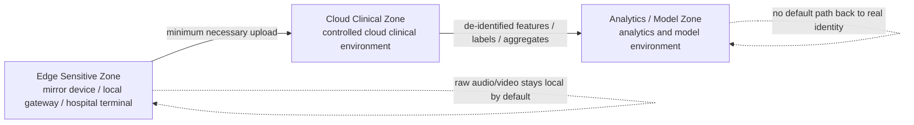

# Privacy Protection and Security Zoning Design for the Cognitive Screening System

## One-Line Principle

We should not push all patient data into a single "central database." Instead, the system should be split into three zones based on **data sensitivity, purpose, and access role**: `Edge Sensitive Zone`, `Cloud Clinical Zone`, and `Analytics / Model Zone`.  
The real privacy and security gain comes from designing **encryption** together with **minimum necessary access, default non-upload of raw data, zone isolation, de-identification, strong approval gates, strong auditability, short retention, and accountable deletion**, rather than relying on any one control by itself.

---

## Scope and Notes

- This document applies to our cognitive impairment early-screening system, including mirror devices, local gateways, hospital terminals, cloud clinical services, and model training and analytics environments.
- The focus here is encryption, transport protection, and also how to improve security and privacy **beyond encryption alone** through system design.
- As of **2026-04-11**, the HHS/OCR website still presents the HIPAA Security Rule update issued on **2024-12-27** as a **proposed rule**. Accordingly, this document uses the **currently effective HIPAA Security Rule and Privacy Rule guidance** as the baseline, while also reflecting the direction of those proposed updates.[1][5]
- This is a technical and governance design document, not formal legal advice or a substitute for HIPAA counsel.

---

## Design Objectives

Under the currently effective HIPAA Security Rule, protecting ePHI is not only about preventing disclosure. HHS/OCR frames the goal around three properties that must all be protected at the same time:[1]

- **Confidentiality**: unauthorized people or processes must not access the data
- **Integrity**: data and results must not be altered or destroyed in an unauthorized way
- **Availability**: authorized people must be able to access and use the data when needed

At the same time, the HIPAA Privacy Rule emphasizes the **minimum necessary** principle, meaning that uses, disclosures, and requests for PHI should be limited to the minimum needed to accomplish the intended purpose.[2]

That means our design target is not "store everything first and decide later." It means:

- raw audio and video stay at the edge by default
- the cloud clinical zone stores only the minimum necessary data for diagnosis and longitudinal follow-up
- the analytics and model zone receives only de-identified features, labels, and aggregate outputs by default
- any cross-zone access requires a **clear purpose, explicit authorization, explicit retention window, and full audit trail**

---

## Three-Zone Separation Architecture

The value of this separation is straightforward:

- even if the analytics zone is misconfigured, compromised, or leaked, it should not directly expose named patient video, raw audio, or full identity records
- even if the clinical zone holds the patient master index, it should not mix clinical operations with training, evaluation, and research access
- even though the edge zone processes the most sensitive raw streams, it should not retain them for long and should not upload them by default

---

## Encryption and PQC Transport

### 1. Bottom line

- **Encryption at rest is mandatory**
- **Encryption in transit is mandatory**
- **The public-key part of transport should move toward PQC, with hybrid PQC preferred during the migration period**

It is important to distinguish two different problems:

- **Data-at-rest encryption** is primarily a symmetric-crypto problem and does not require every storage layer to be rewritten around a PQC primitive
- **Quantum risk is concentrated in the public-key part** of the stack: key exchange, key encapsulation, digital signatures, certificate chains, and some key-wrapping paths

So the more accurate engineering position is not "replace all encryption with PQC." It is:

- keep strong symmetric encryption for stored data
- move transport and key establishment toward PQC or hybrid PQC
- gradually move signatures, software supply chain protection, and high-value object integrity toward NIST-standardized PQC signature mechanisms

### 2. Encryption at rest

Recommended principles:

- object storage, databases, backups, archived logs, and edge-side temporary caches should all use encryption at rest by default
- prefer strong symmetric encryption such as **AES-256**
- use **envelope encryption** wherever possible: data is encrypted with data keys, and data keys are protected by a KMS or HSM
- different zones, data classes, and environments should use separate key hierarchies rather than sharing one universal root key

Recommended application by zone:

- **Edge Sensitive Zone**: encrypt device disks, cache partitions, offline queues, and crash-dump artifacts so device loss does not expose recoverable content
- **Cloud Clinical Zone**: encrypt databases, object storage, backups, search indices, and generated report files
- **Analytics / Model Zone**: encrypt training features, experiment caches, vector indices, evaluation outputs, and exported artifacts

Key-management rules should also include:

- keep master keys in a KMS or HSM rather than application configuration
- rotate keys on a schedule and support revocation by environment, data domain, or patient batch where appropriate
- keep production, testing, and research keys fully separate
- if raw segments are exceptionally uploaded, place them under a shorter TTL and a more tightly controlled key domain

### 3. Encryption in transit

Recommended principles:

- every device-to-gateway, device-to-cloud, service-to-service, backend-to-storage, and backend-to-model-service path should use transport encryption
- default to **TLS 1.3**
- prefer **mTLS** for internal service-to-service traffic
- do not allow plaintext HTTP, plaintext WebSocket, plaintext gRPC, or unauthenticated internal callback paths

### 4. Use PQC in transport

Under current NIST standards, **FIPS 203 (ML-KEM)** was formally published on **2024-08-13** for public-key key establishment, and **FIPS 204 (ML-DSA)** plus **FIPS 205 (SLH-DSA)** were also formally published for digital signatures.[6][7]  
That means our forward-looking transport position should be written clearly:

- **transport key establishment should move toward ML-KEM**
- **during migration, hybrid PQC should be preferred**, combining classical ECDHE with ML-KEM rather than forcing a pure-PQC cutover in one step
- **devices, gateways, clinical-cloud entry points, API gateways, service meshes, reverse proxies, and KMS integration points** should all be crypto-agile so they can be upgraded without redesigning the whole system

The reason is practical:

- interoperability, hardware acceleration, certificate ecosystems, validated modules, and third-party support are still evolving
- as of **2026-04-11**, the IETF TLS working group has an active standardization draft for **TLS 1.3 hybrid ECDHE-MLKEM**, but it is still an Internet-Draft rather than a final RFC, so a **hybrid-first, crypto-agile** migration strategy is more appropriate than hard-coding one supposedly permanent transport profile today.[9]

More concretely, the document can state:

- external transport paths should prefer **TLS 1.3 with hybrid key establishment**
- high-sensitivity internal paths should prioritize hybrid PQC first, especially device-to-clinical ingress, clinical-service-to-primary-storage, and clinical-service-to-key-service traffic
- for environments that want a more FIPS-oriented path, start by evaluating **P-256 + ML-KEM-768**
- for environments that prioritize broad compatibility, start by evaluating **X25519 + ML-KEM-768**

`P-256 + ML-KEM-768` and `X25519 + ML-KEM-768` are **engineering recommendations derived from the current IETF draft direction and industry migration practice**. They are not direct HHS requirements, and they are not the only valid profile for every deployment. Final selection still depends on the TLS library, HSM, gateway, cloud provider, and validation constraints in the actual environment.[9]

### 5. Signatures and object integrity should also enter the PQC migration plan

Transport is not the only place where public-key migration matters. We should also gradually include:

- software update packages
- firmware update packages
- model artifacts
- signed report archives
- signed audit-log archives
- signed cross-zone export files

Recommended direction:

- evaluate **ML-DSA** first for mainstream signature migration
- evaluate **SLH-DSA** when a backup path or more conservative diversification is desired
- during migration, use **classical signatures plus PQC signatures** or parallel verification where needed

### 6. A common misunderstanding to avoid

"Use PQC in transport" does not mean:

- switch every TLS connection to pure ML-KEM-only immediately
- rewrite every database storage path around some imagined "PQC symmetric encryption"
- assume that once PQC is enabled, access control, auditability, zoning, TTLs, and de-identification matter less

The more accurate phrasing is:

> We use strong symmetric encryption and layered key management for data at rest, use TLS 1.3 for transport, and gradually migrate the public-key key-establishment layer toward NIST-standardized PQC; during the migration period, we prefer hybrid PQC to balance quantum resilience, interoperability, and compliance readiness.

---

## 1. Edge Sensitive Zone

Deployment locations:

- mirror devices
- home gateways
- hospital intake terminals

This zone handles:

- camera video streams
- microphone audio streams
- realtime face verification
- local ASR / VAD / preprocessing
- local feature extraction
- temporary caching
- de-identification and minimization before upload

Default principles:

- any **formal patient-related capture, analysis, retention, or upload** at the edge must be gated by the patient's **explicit prior consent**; without completed consent confirmation, the formal session must not begin
- if an ultra-short local preview is needed only to present the consent screen or wake the interaction, that preview must not be written to disk by default, must not be uploaded, and must not enter long-term processing
- raw video is **not uploaded by default**
- raw audio is **not uploaded by default**
- after a session, the preferred upload is **summaries, embeddings, risk scores, segment-level explanations, and quality scores**

If raw segments must be uploaded, all of the following should be required:

1. a clear clinical or quality-control purpose
2. physician authorization or another controlled approval path
3. upload of only the minimum necessary segment, not the full raw session
4. short-lived retention with TTL-based deletion
5. full audit logging

Beyond encryption and transport protection, the edge side should emphasize the following controls:

- **Consent gating**: before formal capture begins, the system should present a clear notice describing the purpose of capture, the data types involved, whether upload will occur, retention duration, and exception scenarios, and it should record the patient's explicit consent through voice, touch, or another auditable mechanism. If the patient declines, formal capture must not proceed.
- **Auditable consent records**: at minimum, record consent time, consent method, notice version, device ID, session ID, and withdrawal status. These records should enter the central audit/compliance domain rather than existing only in the front-end UI.
- **Separate handling for incapacity**: if the patient lacks the ability to provide valid consent independently, the system must use a separate legally authorized representative workflow. A caregiver's casual verbal approval should not be treated as equivalent, and presence alone should never count as consent.
- **Local identity verification**: face verification, liveness checks, and multi-frame stability checks should happen locally whenever possible, so complete face data captured for identity purposes is not pushed to the cloud by default.
- **Short-lived cache**: cache should exist only for reconnect, session recovery, or explicitly approved review; by default it should be deleted immediately after the session, and if retained, preferably only for hours and generally no longer than 24 hours.
- **Pre-upload de-identification**: transcripts should be scanned for direct identifiers such as names, addresses, phone numbers, and medical record numbers; uploaded segments should exclude unrelated people and irrelevant environmental context.
- **Trusted boot and device attestation**: only devices that pass trusted boot, integrity checks, and device authentication should be allowed to connect to the clinical zone.
- **Controlled debug and local export paths**: disable unrestricted USB export, developer mode, plaintext debug logs, and casual copying of cache directories.
- **Local quality gating**: low-quality sessions, multi-person captures, uncertain identity, or severely unintelligible speech should not automatically enter the longitudinal clinical record.

---

## 2. Cloud Clinical Zone

Deployment locations:

- controlled cloud environments
- clinical VPCs or private networks
- hospital-controlled backend environments

This zone stores:

- patient master index
- consent records and authorization status
- single-session diagnostic results
- longitudinal trend features
- anomaly detection outputs
- reports
- audit logs

This zone should not be treated as "store everything." Its job is to support **clinical judgment, longitudinal tracking, and interpretable outputs**.  
It should therefore be divided into logically separate subdomains:

- **identity master index domain**: real identity, patient keys, encounter links, authorization records
- **consent and authorization domain**: consent records, withdrawal records, scope of authorization, representative information, and validity windows
- **clinical feature and result domain**: session-level results, trend features, anomaly scores, reports
- **audit and compliance domain**: access logs, approval records, export records, deletion records

Beyond encryption and transport protection, this zone should emphasize the following controls:

- **Separate data stores and privileges for identity vs. clinical features**: named patient identity data and longitudinal features should not live in the same table, schema, or access role.
- **RBAC plus ABAC**: authorize by job function, but also by patient relationship, institution, purpose tag, and active task context. A clinician should see only patients they are allowed to manage; research users should not have default access to the clinical zone.
- **MFA and JIT privileges**: sensitive operations should use multi-factor authentication and just-in-time elevation rather than standing high-privilege accounts.
- **Break-glass access**: emergency access may exist, but it should require a reason, trigger alerts, and be reviewed afterward.
- **Strong auditability**: all viewing, export, modification, approval, replay of raw segments, and model-result overrides should be traceable. HHS/OCR's audit control requirement is fundamentally about recording and examining system activity.[1]
- **Integrity protection**: reports, model versions, thresholds, and feature writes should carry versioning, timestamps, signatures, or hash checks so that silent tampering is detectable.
- **Availability and contingency planning**: because HHS/OCR requires protection of confidentiality, integrity, and availability together, the system needs backup, restoration drills, emergency mode operation, and failover, not just leak prevention.[1]
- **Vendor and subcontractor control**: any cloud vendor, managed service provider, outside operator, or model provider that can touch ePHI must be governed by contract and strict access boundaries. Internal AI or data science teams should not be treated as automatic exceptions.

---

## 3. Analytics / Model Zone

This is the zone most likely to drift into risky behavior, and it must be explicitly separated from the clinical zone.

This zone is used for:

- model training
- model evaluation
- statistical analysis
- cohort-level research
- data quality analysis
- bias and fairness assessment

Default principles:

- use **de-identified features and labels** by default
- do not provide direct access to full identity information
- do not provide direct access to complete raw video or raw audio
- do not allow ordinary research users to reverse-map back to named patient identities

Beyond encryption and transport protection, this zone should emphasize the following controls:

- **Dataset admission approval**: every training, validation, and analysis dataset should have a documented purpose, field list, retention window, and approval record.
- **Research and production separation**: model workstations, notebooks, experiment systems, vector indices, and temporary export directories must not share the same network, credentials, or administrators as the clinical database.
- **Only necessary granularity**: many training tasks need labels, structured features, segmented transcripts, and quality scores, but not full videos.
- **Output review**: block exports of packages that could re-identify individuals, tiny-sample tables, or case collections with obvious identity clues.
- **Re-identification risk control**: apply extra suppression to rare diseases, rare events, extreme ages, exact timestamps, location details, and small-cell combinations.
- **No default patient mapping table in research**: training environments should not see named patient mappings and should not be able to connect directly to the patient master index.
- **Model artifact review**: inspect prompt logs, error sample sets, caches, experiment tracking systems, vector stores, and exported notebooks for sensitive information.
- **Prohibition on re-identification**: even when data is de-identified, data use terms should explicitly forbid re-identification and linkage back to external identity tables. HHS/OCR's de-identification guidance also notes that recipient agreements can further limit re-identification behavior.[3]

---

## Important Reminder: Embeddings Are Not Automatically Anonymous

This point matters a lot.

From a systems perspective, the following should not be casually treated as "already anonymous":

- face embeddings
- voice embeddings
- fine-grained time-series features
- rare symptom combinations
- long-horizon behavioral trajectories
- transcripts containing original utterance content

HHS/OCR's de-identification guidance makes clear that de-identified data can still retain a small but non-zero re-identification risk.[3]  
So the statement below is an **engineering inference based on HHS principles**, not a direct HHS definition of embeddings:

> Face embeddings, voice embeddings, high-dimensional behavioral features, and multimodal features with fine-grained timestamps should be treated as high-risk pseudonymous features, not assumed to be fully anonymous by default.

This affects at least three design decisions:

- such features should undergo field minimization, precision reduction, aggregation, or additional anonymization review before entering the analytics zone
- embeddings created for identity verification should not automatically be reused as general-purpose training data
- even when the analytics zone receives embeddings, it should not simultaneously receive the named patient mapping table

---

## Exception Workflow for Raw Segment Upload

If raw audio or video must be uploaded for clinical review, model error analysis, complaint investigation, or device QA, the workflow should look like this:

1. **Clear purpose**: for example, "physician review of a specific abnormal assessment" or "microphone distortion investigation," not a generic "system optimization" claim.
2. **Minimum segment**: upload only the relevant 10-second, 30-second, or single-turn segment, not the full session.
3. **Approval record**: log requester, approver, purpose, patient scope, segment duration, and access window.
4. **Short retention**: set automatic deletion so the segment becomes unavailable, non-restorable, and non-shareable after the approved period.
5. **No secondary use by default**: raw segments uploaded for clinical review should not automatically flow into training datasets.
6. **Higher access bar**: viewing raw segments can require a stronger role or dual approval.
7. **Post-hoc review**: periodically review who accessed raw segments, why they did so, and whether deletion happened on time.

---

## Controls That Matter Beyond Encryption and PQC

| Control | Why it matters | Recommended approach |
|---|---|---|
| Data minimization | Reduces exposure surface | Upload only summaries, scores, features, and required explanations by default |
| Zone isolation | Limits blast radius after compromise | Separate network, privilege, and data domains for Edge, Clinical, and Analytics |
| Minimum necessary access | Prevents opportunistic overuse | Authorize by role and purpose at fine granularity |
| Approval workflows | Prevents ad hoc raw-data use | Require approval and logging for raw-segment upload, export, and review |
| Audit and alerting | Enables accountability | Log and alert on viewing, export, abnormal access, and privilege misuse |
| Integrity checks | Prevents silent tampering | Use hashes, signatures, version locking, and traceable provenance |
| Short retention | Lowers long-term exposure | Use hour-level edge cache TTL and automatic deletion for exceptions |
| Deletion closure | Avoids "deleted in UI but still present elsewhere" | Cover primary stores, caches, indices, and backups |
| Availability design | Preserves clinical continuity | Use backups, restore drills, emergency mode, and offline degradation paths |
| Research isolation | Keeps R&D away from named clinical data | Separate research datasets from patient master index and identity mappings |
| Third-party governance | Keeps vendors from becoming the weak link | Use BAAs, access boundaries, least privilege, and subcontractor controls |
| Periodic review | Risks change over time | Re-run risk analysis, permission review, log sampling, and config review regularly |

---

## Recommended Routing for Data Objects

| Data object | Edge Sensitive Zone | Cloud Clinical Zone | Analytics / Model Zone | Default policy |
|---|---|---|---|---|
| Raw video | Temporary processing | Exception-only short retention | Not allowed by default | Do not upload by default |
| Raw audio | Temporary processing | Exception-only short retention | Not allowed by default | Do not upload by default |
| Consent record | Local capture and confirmation | Officially stored | Not allowed by default | Clinical / audit domain system of record |
| Full transcript | Temporary processing / de-identification | Controlled storage only if clinically needed | De-identified or summarized only | Do not distribute full transcripts to research by default |
| Face embedding | Prefer local verification | Only as needed for identity gating | No named mapping by default | Treat as sensitive pseudonymous data |
| Voice embedding | Local or tightly controlled clinical use | Only for necessary use cases | No named mapping by default | Treat as sensitive pseudonymous data |
| Risk score | May be generated | Officially stored | May be used for evaluation | Can cross zones without names |
| Longitudinal trend features | May be pre-extracted | Officially stored | May be analyzed after de-identification | Clinical zone remains the source of truth |
| Report | Not the long-term system of record | Officially stored | Not allowed by default | Clinical zone only |
| Audit log | Local event logs | Central audit system of record | Minimum necessary access only | Clinical / security domain only by default |

---

## Mapping to HHS / HIPAA Principles

| HHS/OCR principle | Meaning for our design |
|---|---|
| Confidentiality / Integrity / Availability must all be protected [1] | We need leak prevention, tamper resistance, backups, recovery, and emergency access |
| Minimum Necessary [2] | Raw audio and video should not be uploaded by default; only minimum required fields and results should move upstream |
| Risk analysis and ongoing review [1][4] | Every new model, field, vendor, or export path should trigger renewed review |
| Audit Controls [1] | Viewing, export, approval, review, deletion, and override actions must be recorded and reviewable |
| Authentication [1] | Both people and services must authenticate; avoid shared accounts and long-lived secrets |
| Integrity [1] | Reports, features, thresholds, and model versions need integrity protection |
| Contingency Planning [1] | The system must remain usable during incidents; security without availability is insufficient in healthcare |
| De-identification is not zero risk [3] | Embeddings, transcripts, and rare-event combinations should not be mistaken for inherently anonymous data |

---

## Recommended Rollout Priorities

### P0: required before any clinical pilot

- edge consent capture, stop-on-decline behavior, and audited consent records are in place
- edge does not upload raw audio or video by default
- approval workflow exists for exception-based raw segment upload
- patient master index is separated from clinical features
- RBAC, MFA, and audit logging are in place
- edge cache TTL and automatic deletion are enforced
- the training zone is isolated from the clinical zone at both network and identity layers

### P1: should be added before broader launch

- break-glass workflow
- signed results and model-version provenance
- export approval and anomaly alerting
- transcript de-identification pipeline
- vendor and subcontractor access governance

### P2: strengthen before scaling

- expert de-identification review process
- clean-room style research environment
- small-cell statistical output review
- re-identification risk testing for embeddings and high-dimensional features
- regular access review and sampled audit-log inspection

---

## Suggested External Wording

This is a concise public-facing version:

> We do not upload all patient audio and video into a single central database. Instead, the system is split into three zones: an edge sensitive zone, a cloud clinical zone, and an analytics/model zone. Raw audio and video stay on device by default, the clinical cloud stores only the minimum necessary data for diagnosis, trends, and reporting, and the analytics zone uses de-identified features and labels by default. This means that even if an analytics environment has a problem, it should not directly expose named patient video or full identity records.

A more technical version:

> Our privacy design is not "encryption only." We use strong symmetric encryption and layered key management for stored data, gradually move transport toward PQC / hybrid PQC, and combine that with minimum necessary access, zone isolation, pseudonymization, auditability, short retention, and a controlled raw-data exception workflow. The goal is to protect confidentiality, integrity, and availability together, not just reduce the chance of data leakage.

---

## References

[1] HHS/OCR, Summary of the HIPAA Security Rule  
[https://www.hhs.gov/hipaa/for-professionals/security/laws-regulations/index.html](https://www.hhs.gov/hipaa/for-professionals/security/laws-regulations/index.html)

[2] HHS/OCR, Minimum Necessary Requirement  
[https://www.hhs.gov/hipaa/for-professionals/privacy/guidance/minimum-necessary-requirement/index.html](https://www.hhs.gov/hipaa/for-professionals/privacy/guidance/minimum-necessary-requirement/index.html)

[3] HHS/OCR, Guidance Regarding Methods for De-identification of Protected Health Information  
[https://www.hhs.gov/hipaa/for-professionals/special-topics/de-identification/index.html](https://www.hhs.gov/hipaa/for-professionals/special-topics/de-identification/index.html)

[4] HHS/OCR, Final Guidance on Risk Analysis  
[https://www.hhs.gov/hipaa/for-professionals/security/guidance/final-guidance-risk-analysis/index.html](https://www.hhs.gov/hipaa/for-professionals/security/guidance/final-guidance-risk-analysis/index.html)

[5] HHS/OCR, HIPAA Security Rule NPRM Fact Sheet, issued on 2024-12-27 and still presented by HHS as a proposed rule as of 2026-04-11  
[https://www.hhs.gov/hipaa/for-professionals/security/hipaa-security-rule-nprm/factsheet/index.html](https://www.hhs.gov/hipaa/for-professionals/security/hipaa-security-rule-nprm/factsheet/index.html)

[6] NIST/CSRC, FIPS 203, Module-Lattice-Based Key-Encapsulation Mechanism Standard, published 2024-08-13  
[https://csrc.nist.gov/pubs/fips/203/final](https://csrc.nist.gov/pubs/fips/203/final)

[7] NIST/CSRC, Announcement of approved PQC FIPS 203 / 204 / 205, published 2024-08-13  
[https://csrc.nist.gov/News/2024/postquantum-cryptography-fips-approved](https://csrc.nist.gov/News/2024/postquantum-cryptography-fips-approved)

[8] NIST, Post-Quantum Cryptography program page, stating that organizations should begin applying the 2024 PQC standards now  
[https://www.nist.gov/pqc](https://www.nist.gov/pqc)

[9] IETF TLS Working Group Internet-Draft, Post-quantum hybrid ECDHE-MLKEM Key Agreement for TLS 1.3, published 2026-02-08, still draft as of 2026-04-11  
[https://datatracker.ietf.org/doc/html/draft-ietf-tls-ecdhe-mlkem](https://datatracker.ietf.org/doc/html/draft-ietf-tls-ecdhe-mlkem)
