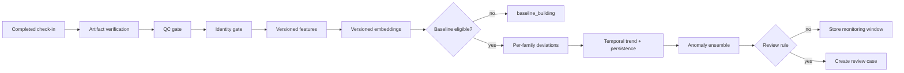

# Reflexion 纵向监控与向量异常检测设计

> 状态：算法与产品安全基线
> 日期：2026-07-22
> 适用范围：Home daily check-in、clinic follow-up、provider review
> 核心原则：比较患者与其自身历史，而不是把一次对话映射为疾病标签

## 1. 输出边界

纵向引擎回答三个问题：

1. 当前数据是否足够可信、足够完整？
2. 最近状态是否偏离该患者的个人稳定范围？
3. 变化是否持续、是否值得专业人员复核？

它不回答“患者是否患有痴呆”。对外状态限定为：

- `insufficient_data`
- `baseline_building`
- `stable`
- `watch`
- `review_recommended`
- `priority_review`
- `excluded`

Caregiver/患者端进一步映射为：`building / on_track / repeat_needed / review_pending`。疾病名称、原始研究分数和未经复核的 LLM 结论不直接展示。

## 2. 为什么不能只做向量相似度

向量距离可能同时受到主题、语言、情绪、麦克风、ASR、背景噪声、prompt 版本和模型升级影响。一个“离 baseline 很远”的 embedding 不等于认知恶化。

生产异常检测必须是多证据系统：

```text
quality + identity + protocol coverage
        ↓ gate
interpretable scalar/task features
        + homogeneous embeddings
        + temporal persistence
        + adherence/context
        ↓
versioned anomaly state
        ↓
provider review workflow
```

向量用于描述同一模型空间内的高维变化；可解释结构化特征、QC、时间持续性和 reviewer feedback 决定它能否被采用。

## 3. 输入与用途分区

| 输入 | 例子 | 异常检测用途 |
|---|---|---|
| Speech acoustic | 语速、停顿、发音速率、反应延迟、pitch variability | 主要输入；相对不依赖谈话主题 |
| Language/semantic | 词汇多样性、信息单元、语义连贯、word-finding marker | 主要/次要输入；必须按语言和 protocol 校准 |
| Structured task | 回忆、定向、执行步骤、提示依赖 | 主要输入；需要相同 task/protocol 版本 |
| Interaction | 完成率、中断、caregiver 代答、所需提示 | QC 和辅助变化输入 |
| Semantic embedding | turn/session 内容 embedding | 次要输入；主题敏感，不能单独报警 |
| Acoustic embedding | 标准化语音片段 embedding | 次要/研究输入；需要设备和音质控制 |
| Face identity embedding | 身份核验 | **只做身份 gate，不进入认知 anomaly score** |
| 普通 companion 对话 | 天气、闲聊、提醒 | 默认不进入正式基线；可用于独立的低风险产品研究流 |

严禁把身份向量、语义向量、声学向量和任务标量直接拼接后计算一次距离。每个 feature family 独立标准化、独立版本、独立缺失策略和独立贡献解释。

## 4. 处理流水线



每一步产生独立、可重试的 `processing_run`。重算写新 revision；旧 revision 保留用于复现。

## 5. Gate 先于算法

### 5.1 Consent gate

- monitoring purpose 在 capture 时有效。
- 撤回后不创建新 session，未处理 session 停止进入 pipeline。
- 研究用途和产品用途分别记录，不能用一个同意自动覆盖所有用途。

### 5.2 Identity gate

- device assignment 有效。
- 目标说话人/人物有足够证据属于该患者。
- caregiver 代答、多人主导或身份置信度不足：`manual_review` 或 `exclude`。
- 人脸不是唯一身份依据；可组合设备绑定、主动确认、说话人、face link 和会话上下文。

### 5.3 QC gate

最低检查：

- 患者有效语音时长和轮次。
- task/protocol coverage。
- 背景噪声、回声、截断、ASR 置信度。
- 麦克风/摄像头 profile 和软件版本。
- 语言匹配。
- caregiver speech ratio。
- 急性不适、明显疲劳、听力问题或环境干扰等 context flag。

Gate verdict：

- `include`
- `include_with_caveats`
- `repeat_requested`
- `manual_review`
- `exclude`

低质量 session 不应仅通过乘一个较小权重“勉强进入”基线；会系统性污染个人正常范围。

## 6. Baseline 建立

### 6.1 两级 baseline eligibility

正式需求定义了一个用于 caregiver reassurance MVP 的运营基线：

- 滚动 14 个日历日；
- 至少 7 个 completed session；
- 第 14 天不足 7 次时继续保持 `establishing`，直到满足 session 数；
- 每 7 天更新，初始规则使用 EWMA `alpha = 0.1`；
- baseline 完成前不触发基于个人变化的 amber/red，caregiver 只看到学习进度和当天是否完成。

这个运营基线仅服务 M1–M5 的日常 reassurance status，不应被称为临床或认知 baseline。

研究/高级纵向监控使用更严格的默认 eligibility：

- 至少 12 个高质量 session；
- 跨至少 28 天；
- 至少覆盖 3 个不同周；
- 至少 70% 计划 session 有可用数据；
- 没有未解决的大规模 protocol/device/model 切换；
- baseline window 内不能包含 reviewer 确认的急性异常期。

两种 baseline 必须使用不同 `baselineType`、algorithm version 和输出字段。14 天运营状态不能作为认知变化已经验证的证据；12/28/3 周也只是研究默认值，仍需在真实纵向 cohort 上校准。

### 6.2 Personal first, population prior second

- baseline 完成前，可用年龄/语言/设备分层的 population prior 做 QC 和范围 sanity check，但产品状态仍为 `baseline_building`。
- baseline 完成后，异常主要相对个人历史计算。
- population percentile 可以提供研究上下文，不直接覆盖 personal anomaly。

### 6.3 标量特征基线

对每个稳定的标量特征保存：

- median
- MAD（median absolute deviation）
- 有效样本数
- missing rate
- winsorized/allowed range
- device/protocol/language strata

鲁棒偏离：

```text
robust_z = 0.6745 * (x - median) / max(MAD, epsilon)
```

方向由 feature registry 定义，例如 pause ratio 上升可能是负向，semantic coherence 上升可能是正向。不能把绝对值相同的偏离都解释为恶化。

对于高度相关的特征组，样本足够后可使用 shrinkage covariance 的 Mahalanobis distance；样本不足时坚持单变量 robust score，避免高维协方差不稳定。

### 6.4 向量基线

每个 homogeneous embedding family 独立保存：

- 同一 model/version/dimensions/normalization 的 baseline vector set。
- robust medoid 或 trimmed normalized centroid。
- baseline 内 cosine-distance median/MAD/quantiles。
- session 数、时间跨度、语言和 protocol。

新向量的两个互补距离：

```text
centroid_distance = 1 - cosine(new_vector, baseline_centroid)
history_distance  = median(k smallest exact distances to eligible personal history)
```

个人历史量通常很小，优先 exact calculation；Vector Search 用于快速候选检索、cohort 分析和研究工具。任何近邻查询都必须预过滤 tenant、patient、模型版本、protocol、language、inclusion 和日期。

### 6.5 Baseline revision

baseline 是版本化模型，不是不断修改的一行：

- 新可用 session 到达后，按 policy 创建候选 revision。
- 异常期 session 在 reviewer 处置前不自动纳入正常 baseline。
- 稳定期滚动更新可使用最大时间窗或衰减权重。
- 所有 anomaly score 固定引用计算时的 baseline revision，不能随 baseline 更新而改变历史含义。

## 7. 时间序列与持续性

单次偏离只生成 observation，不直接升级。首期组合：

- rolling median / robust slope
- EWMA 用于缓慢变化
- CUSUM 或 change-point detector 用于持续水平迁移
- rolling volatility 用于不稳定性
- 预定义 persistence：`2_of_3`、`3_of_5` 或连续两周

默认升级示例：

- `watch`：单次中度异常，或某一分量异常但其余证据不一致。
- `review_recommended`：高 QC 下满足 2-of-3 中度偏离，或多 feature family 一致变化。
- `priority_review`：高 QC 的大幅变化持续两次，或 provider 定义的急性安全规则触发。
- `repeat_needed`：QC 不足而不是认知变化；不计入异常 persistence。

“sharp persistent deterioration”的数值边界必须在验证集锁定，不能由 LLM 临时判断。

## 8. Ensemble 评分

### 8.1 分量

```text
structuredDeviation  可解释标量的定向 robust deviation
taskDeviation        相同 protocol task 的个人偏离
embeddingDeviation   同构声学/语义向量偏离
trendChange          slope/EWMA/CUSUM/change-point
crossFamilyAgreement 多模态/多特征方向一致性
contextPenalty       acute/context/device shift
qualityConfidence    QC、coverage、identity confidence
```

### 8.2 首期规则型 ensemble

在自有数据不足时，使用透明版本化规则，而不是训练一个不可验证的大模型分数：

```text
raw =
  w1 * structuredDeviation +
  w2 * taskDeviation +
  w3 * embeddingDeviation +
  w4 * trendChange +
  w5 * crossFamilyAgreement

confidence = f(QC, identity, coverage, missingness, model compatibility)
overall = calibrated(raw, confidence, contextPenalty)
```

权重、归一化、阈值和 calibration curve 全部进入 `rule_registry/model_registry`。缺失 family 采用经验证的 renormalization 或直接降为 `insufficient_data`；禁止把缺失值当 0。

随着 proprietary longitudinal dataset 成熟，可比较规则、mixed-effects model、one-class model、isolation forest、temporal encoder 等候选，但产品切换必须满足锁定测试集、patient-level split、外部验证、校准和变更控制。

## 9. 可解释输出

每个 anomaly 必须包含机器可读 reason code，不能只存 LLM 文案：

```json
{
  "code": "SPEECH_PAUSE_RATIO_PERSISTENT_INCREASE",
  "feature": "speechAcoustic.pauseRatio",
  "direction": "worse",
  "current": 0.36,
  "baselineMedian": 0.23,
  "robustZ": 2.91,
  "persistence": "2_of_3",
  "contribution": 0.22,
  "qualityConfidence": 0.91
}
```

LLM 只能把已批准 reason code 翻译为适合 caregiver/provider 的自然语言，不能创造新的证据或改变 alert band。

## 10. 模型、设备和数据漂移

需要监控两类漂移：

### 患者内变化

产品真正关心的个人长期偏离。

### 系统漂移

- embedding/ASR/model provider 版本变化
- prompt/protocol 变化
- 设备或麦克风硬件变化
- 语言/口音 cohort 的 error rate 差异
- feature missingness、QC rejection 和 score distribution 变化

每次 session 和结果都记录：

- model/pipeline/feature/protocol/prompt version
- device/capture profile
- input hash 和 artifact references
- code artifact hash
- baseline and rule revision

模型升级策略：

1. 新旧 pipeline 对一段历史数据 shadow recompute。
2. 比较 feature distribution、distance distribution、alert concordance 和 subgroup performance。
3. 新 model 写新 embedding index，不覆盖旧 vector。
4. 如果跨版本不可比，重新建立 baseline 或使用经验证的 bridge calibration。
5. 在 release registry 批准后切换 active read version。

## 11. Reviewer 反馈闭环

Review disposition 建议枚举：

- `confirmed_meaningful_change`
- `no_meaningful_change`
- `acute_or_reversible_context`
- `poor_quality`
- `wrong_identity`
- `protocol_issue`
- `follow_up_ordered`
- `insufficient_information`

反馈用途分开：

- 产品运营：关闭 case、安排复测/随访。
- 规则评估：计算 alert burden、PPV-like review yield、time-to-review。
- 模型开发：只有经过 adjudication 和 dataset approval 的 label 才能进入训练集。

禁止从单个 caregiver 点击或未复核的 case 自动在线学习，避免反馈污染。

## 12. 评估设计

### 12.1 数据切分

- patient-level split，禁止同一患者跨 train/test。
- 时间外推测试：用早期历史预测后续窗口。
- site/device/language subgroup 报告。
- 锁定测试集只用于 release gate，不用于反复调参。

### 12.2 技术指标

- feature reproducibility / test-retest reliability
- baseline completion rate 和所需天数
- anomaly detection sensitivity/specificity against adjudicated change label
- calibration 和 confidence coverage
- alert per patient-month
- false review burden
- detection lead time
- QC/identity exclusion rate
- missingness 和 subgroup disparity
- model/version migration concordance

### 12.3 产品指标

- 计划 session adherence
- repeat request completion
- review case SLA
- reviewer overturn rate
- caregiver message comprehension/harms
- 从 case 到临床行动的转化和延迟

## 13. 失败模式与保护

| 失败模式 | 保护 |
|---|---|
| 家属代答污染 baseline | speaker/identity gate；caregiver ratio；manual review |
| 新麦克风导致向量突变 | capture profile 分层；device-change quarantine/shadow baseline |
| 主题变化导致 semantic embedding 偏移 | 固定 check-in protocol；semantic 低权重；结构化/声学一致性要求 |
| ASR 版本升级 | 全量版本记录；shadow recompute；新 baseline revision |
| 少量 session 过拟合 baseline | 最低 session/day/week 规则；robust statistics；`building` 状态 |
| 异常被自动吸收进新 baseline | anomaly quarantine；review 后才允许 rebaseline |
| 低 QC 产生高分 | gate；`repeat_needed`；不进入 persistence |
| 单次 LLM 文案触发告警 | LLM 不拥有 alert rule；只翻译结构化 reason code |
| ANN 近邻跨 tenant/模型泄漏 | tenant + patient + model pre-filter；repository 强制策略 |
| mock/synthetic 数据进入产品 | model registry allowlist；source=`synthetic/mock` 永久禁止 production inclusion |

## 14. 首个可交付版本

### V0：数据可信

- 统一 session、artifact、QC、identity 和 feature schema。
- 真实 feature extraction；删除生产 mock embedding 和 synthetic trend。
- provider 查看 session 级可解释特征，不产生 anomaly alert。

### V1：个人 baseline

- MVP 先实现 14 天/7 completed sessions 的运营 baseline 和 M1–M5 status。
- 研究管线另行实现 12 sessions/28 days/3 weeks 的高质量 feature baseline。
- 标量 robust baseline、missingness、coverage 和 baseline revision。
- `baseline_building/stable` 输出。

### V2：异常与复核

- structured/task deviation + persistence。
- review case、disposition、caregiver-safe 状态。
- alert burden 和 subgroup monitoring。

### V3：向量增强

- 经验证的 acoustic/semantic embedding family。
- exact personal distance + Atlas filtered retrieval。
- shadow evaluation 后加入低权重 ensemble。

向量增强放在结构化纵向闭环之后。这样即使 embedding 模型延迟或升级，核心监控仍然可解释、可复现和可运营。

## 15. 完成标准

- 任意异常结果都能从 `anomalyScore → baselineRevision → featureSnapshot → QC/identity → session/artifact` 完整追溯。
- baseline 不足时绝不生成伪造趋势或确定性风险状态。
- identity face vector 不进入认知 scorer，且 caregiver 无权读取任何 raw vector。
- 处理任务可重试、幂等，重复事件不会生成重复 result/review case。
- 模型/feature/protocol 升级不会静默混合不可比向量。
- provider 可以看到结构化原因并记录 disposition；caregiver 只看到经规则批准的安全措辞。
