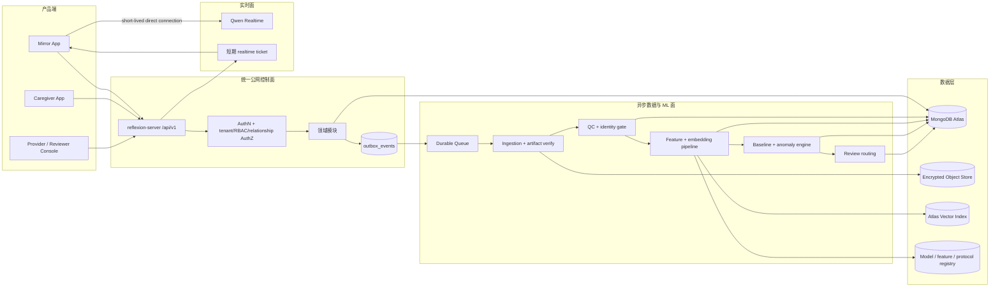
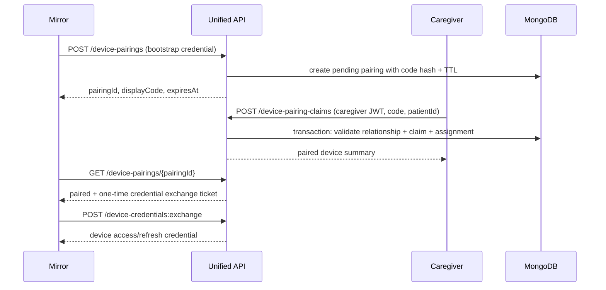
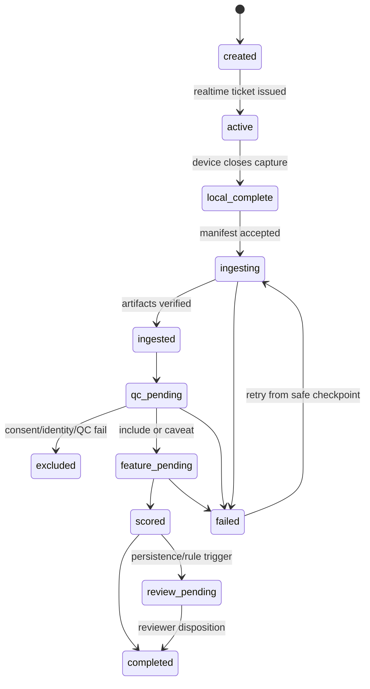

# Reflexion Platform v2：API 与领域架构

> 状态：目标设计基线
> 日期：2026-07-22
> 适用范围：Mirror App、Caregiver App、Provider/Reviewer Console、reflexion-server、异步分析服务
> 核心目标：用一个统一控制面支撑设备配对、日常助手、每日认知采集、纵向监控和专业复核

## 1. 架构结论

1. 以 `reflexion-server` 的 `/api/v1` 作为唯一 API 控制面；最终公网域名由部署时配置，Mirror 与 Caregiver 通过同一个 `EXPO_PUBLIC_API_BASE` 接入，不绑定 Vercel。
2. reflexion-server 第一阶段保持 TypeScript/Express **模块化单体**，按领域拆模块，不立即拆成多个微服务。
3. 实时语音仍由 Mirror 通过短期 ticket 直连 Qwen；统一 API 负责授权、策略、session 事实源和结果回传，不代理长时间音视频 WebSocket。
4. API 服务只承载短请求控制面。QC、身份门控、特征提取、embedding、评估、基线和异常检测通过 transactional outbox 和长期运行的 worker 处理。
5. MongoDB Atlas 是结构化业务和分析元数据的事实源；对象存储保存音频、视频、大转录文件；Atlas Vector Search 可保存和检索同构 embedding，但“向量库”本身不等于异常检测引擎。
6. 所有患者数据按 `tenantId + patientId` 隔离。Caregiver、provider、device 是不同主体，使用不同凭据和授权路径。
7. 单次会话只产生“质量合格的观察”；纵向引擎只输出变化状态和复核建议，不输出自动疾病诊断。

## 2. 当前设计必须替换的问题

| 当前实现 | 问题 | v2 决策 |
|---|---|---|
| `NursePatientConfig` 内嵌 caregiver 和 patients | 无法表达多个 caregiver/provider、患者共享、独立生命周期和细粒度权限 | 拆为 `users`、`patients`、`care_relationships`、`program_enrollments` |
| 登录只返回 `nurseId` | 客户端可伪造任意 ID，服务端没有会话身份 | OIDC/JWT access token；每次请求从 token 获取 actor 和 tenant |
| `deviceAuthToken` 明文嵌入 patient | 长期秘密泄漏面大，无法安全轮换 | 独立 `device_credentials`，只存 hash/key reference 和版本 |
| `MirrorIdToNurseIdMap` | 关系冗余且会与嵌套 patient 漂移 | `device_assignments` 成为唯一绑定事实源 |
| `ConversationIdToPatientIdMap` | 会话与患者映射冗余，需要多集合拼接 | `sessions` 直接带 tenant/patient/device 主键 |
| 对话日志整块存入 `Conversation.logs[]` | 文档持续增长，事件幂等、增量同步和局部查询困难 | `sessions` 保存摘要，`session_events`/`transcript_turns` 追加写 |
| pairing session 保存 `authToken` | 配对码和设备长期权限混在一起 | pairing 仅授权一次 claim；配对成功后单独签发可轮换设备凭据 |
| mirror Expo API 和 caregiver Express API 两套路由 | 生产域名、认证、错误格式和数据逻辑分裂 | 全部迁入 `/api/v1`，旧路由只做限时兼容 |
| 评估结果直接 `healthy / dementia` | 单次 LLM 结论缺少质量、版本、基线和复核 | `session_observation` 与 `longitudinal_anomaly` 分层 |
| 哈希生成 mock embedding 和 synthetic trend | 不是有效模型输出，并会制造不存在的历史证据 | 禁止进入生产链路；真实 pipeline 不足时返回 `insufficient_data` |

## 3. 顶层逻辑架构



### 为什么不是现在就拆微服务

- 当前团队和流量尚不需要独立服务的部署与运维成本。
- 配对、患者关系、care plan 和 session 创建需要一致的授权与事务边界。
- 先通过模块接口、outbox 事件和独立 worker 建立边界，未来可以按吞吐和合规要求把模块拆出，而不改变公开 API。
- HTTP 控制面与长期 worker 进程从部署上分离；实时 WebSocket 和 CPU/GPU 分析不占用 API 请求生命周期。

## 4. 领域模块

| 模块 | 唯一职责 | 不负责 |
|---|---|---|
| `identity-access` | 用户身份、token 验证、tenant、角色、患者关系授权 | 患者业务资料 |
| `patient-program` | 患者资料、项目 enrollment、语言/时区、同意记录 | 登录和设备密钥 |
| `device-fleet` | 设备注册、配对、绑定、凭据轮换、健康状态 | 会话分析 |
| `care-plan` | 药物计划、提醒规则、日程和 occurrence | 让模型自由生成剂量 |
| `session` | session 创建、协议冻结、状态机、事件接收、完成 | 直接给出认知异常结论 |
| `realtime-broker` | 签发短期 provider ticket、选择 prompt/policy/model | 保存长期 Qwen 密钥到设备 |
| `artifact` | 预签名上传、manifest、hash、加密和保留策略 | 把媒体放进 MongoDB JSON |
| `processing` | job 状态、重试、dead-letter、pipeline revision | 在 HTTP 请求内跑完整分析 |
| `status-engine` | MVP M1–M5、设备可达性、14 天/7 次运营基线、确定性绿/黄/红 caregiver 状态 | 疾病或临床风险判断 |
| `monitoring` | 研究/高级纵向 baseline、feature/embedding 异常、纵向窗口和复核建议 | 直接覆盖 MVP status 或疾病自动诊断 |
| `review` | reviewer case、处置、反馈标签、升级 | 自动把研究分数发给患者 |
| `notification` | push、镜面提醒、偏好、免打扰、送达状态 | 决定临床风险阈值 |
| `audit` | actor/action/object/outcome/correlation trace | 可变业务状态 |

模块间禁止直接复用集合查询。模块通过 repository/service 接口或版本化内部事件读取数据，避免重新形成“任何路由都能访问任何 collection”的结构。

## 5. 统一身份与授权

### 5.1 主体类型

| 主体 | 凭据 | 典型权限 |
|---|---|---|
| Caregiver | OIDC/JWT access + refresh token | 只访问 `care_relationships` 授权的患者和 caregiver-safe 输出 |
| Provider/Reviewer | OIDC/JWT + MFA/组织策略 | 访问组织授权患者、完整质量/证据和 review case |
| Mirror device | 安装 bootstrap credential；配对后轮换为 device credential | 只访问当前 assignment 对应患者；创建 session、上传和读取设备配置 |
| Internal worker | workload identity/service token | 只消费指定 job、写指定派生集合 |

### 5.2 授权不变量

- API 不接受 `nurseId` 作为授权依据；actor 从 token 解析。
- 所有 patient-scoped repository 方法都要求显式 `tenantId` 和 `patientId`。
- caregiver 请求还必须验证 active `care_relationship`；device 请求验证 active `device_assignment`。
- provider/reviewer 的访问记录进入不可变 audit。
- 任意跨 tenant 查询默认拒绝，只有显式 platform-admin/research export 工作流可例外。
- `tenantId`、`patientId`、`deviceId` 从服务端关系解析，不能直接信任请求 body 中的冗余值。

## 6. Pairing v2



关键规则：

- 展示码 6 位，只存 hash；`pairingId` 是不可猜的随机 ID。
- pairing code 最多尝试 5 次，短 TTL，claim 采用原子状态迁移。
- 一位患者默认只能有一个 active primary mirror；更换设备使用显式 replace/revoke 流程。
- pairing 记录不存长期 device token。
- credential exchange ticket 单次使用，日志和 URL 中不出现 token。

## 7. Session 是唯一事实源

### 7.1 Session 类型

- `companion`：天气、日程、提醒、陪伴；默认不进入认知纵向管线。
- `daily_checkin`：协议化 2–5 分钟采集；通过 consent、identity 和 QC 后才可进入纵向管线。
- `clinic_assessment`：provider 发起的受控评估。
- `device_test`：麦克风、摄像头、网络测试；永不进入纵向管线。

工具事件可以保存在任何 session 中，但只有 `daily_checkin`/`clinic_assessment` 的受控 observation 进入认知特征提取。普通天气聊天不应因语义或情绪偶然变化触发认知告警。

### 7.1.1 两层状态模型

正式需求把产品定义为 caregiver reassurance system。因此后端必须区分：

- `operationalStatus`：MVP 确定性状态引擎，使用 session 完成、missed streak、时间窗、用户语音时长、周频率、技术错误和 heartbeat。它只回答日常互动是否按个人常态进行。
- `longitudinalReviewState`：研究/高级监控层，使用 QC 合格的结构化特征和同构 embedding，只产生 `insufficient_data/stable/watch/review_recommended` 等复核状态。

两层结果存储、版本和权限分开。高级监控结果未经验证和 reviewer policy 批准，不得直接把 caregiver 卡片升级为红色。Mirror 永远不计算或展示任一 caregiver 状态。

### 7.2 生命周期



状态迁移通过 compare-and-set 的 `stateVersion` 保护。客户端只可以请求命令，例如 `:complete`；不能直接写任意状态。

### 7.3 冻结的运行上下文

每个 session 创建时冻结：

- `protocolVersion`
- `promptVersion`
- `toolPolicyVersion`
- `featureSchemaVersion`
- `intendedUseVersion`
- `consentId/purpose`
- `language/timezone`
- `device/software/captureProfile`

后续重算创建新的 `processingRevision`，不覆盖原始 capture context。

## 8. API v1 规范

### 8.1 通用约定

- 基础路径：`/api/v1`。
- JSON 字段统一 `camelCase`；数据库内部也尽量保持同名。
- 所有写请求接收 `X-Request-Id`；创建、完成、tool side effect 和批量事件必须带 `Idempotency-Key`。
- 时间统一 ISO 8601 UTC；同时保存业务发生地 `timezone`，展示时再转换。
- 列表使用 cursor pagination，不使用大 offset。
- 异步工作返回 `202 Accepted` 和 `operationId`；客户端查询资源状态，不等待分析完成。
- 错误使用统一 envelope 和稳定 `code`，不把内部堆栈返回客户端。
- 乐观并发使用 `version`/`If-Match`；重要跨集合写入使用短事务。

成功响应：

```json
{
  "data": {},
  "meta": { "requestId": "req_..." }
}
```

错误响应：

```json
{
  "error": {
    "code": "PAIRING_CODE_EXPIRED",
    "message": "Pairing code is invalid or expired.",
    "retryable": false,
    "details": []
  },
  "meta": { "requestId": "req_..." }
}
```

### 8.2 外部 API 路由目录

#### 身份与当前用户

- `POST /auth/sessions`：过渡期邮箱登录；目标是接 OIDC。
- `POST /auth/session-refreshes`
- `DELETE /auth/sessions/current`
- `GET /me`

#### 患者与关系

- `GET /patients`
- `POST /patients`
- `GET /patients/{patientId}`
- `PATCH /patients/{patientId}`
- `GET /patients/{patientId}/care-relationships`
- `POST /patients/{patientId}/consents`
- `GET /patients/{patientId}/program-enrollments/current`

#### 设备与配对

- `POST /device-pairings`
- `GET /device-pairings/{pairingId}`
- `POST /device-pairing-claims`
- `POST /device-credentials/exchange`
- `GET /devices/{deviceId}`
- `POST /devices/{deviceId}/credential-rotations`
- `POST /devices/{deviceId}/revocations`
- `GET /devices/{deviceId}/configuration`
- `POST /devices/{deviceId}/heartbeats`

#### 会话与实时

- `POST /sessions`
- `GET /sessions/{sessionId}`
- `GET /sessions/{sessionId}/processing-status`
- `POST /sessions/{sessionId}/realtime-tickets`
- `POST /sessions/{sessionId}/event-batches`
- `POST /sessions/{sessionId}/artifact-upload-plans`
- `POST /sessions/{sessionId}/artifacts/commit`
- `POST /sessions/{sessionId}/complete`
- `POST /sessions/{sessionId}/upload-retries`
- `POST /sessions/{sessionId}/abandon`

#### Care plan、药物与提醒

- `GET /patients/{patientId}/care-plan`
- `PUT /patients/{patientId}/care-plan`
- `GET /patients/{patientId}/medication-plans`
- `POST /patients/{patientId}/medication-plans`
- `PATCH /medication-plans/{planId}`
- `GET /patients/{patientId}/reminder-occurrences?from=&to=`
- `POST /reminder-occurrences/{occurrenceId}/responses`
- `POST /patients/{patientId}/caregiver-tasks`

#### 监控与复核

- `GET /patients/{patientId}/status`
- `POST /patients/{patientId}/away-periods`
- `POST /patients/{patientId}/manual-flags`
- `GET /patients/{patientId}/monitoring/summary`
- `GET /patients/{patientId}/monitoring/timeline`
- `GET /notifications`
- `POST /notifications/{notificationId}/read`
- `GET /patients/{patientId}/monitoring/baseline`
- `GET /review-cases`
- `GET /review-cases/{caseId}`
- `POST /review-cases/{caseId}/dispositions`

Caregiver 的 monitoring API 只返回 `building / on_track / repeat_needed / review_pending` 等安全状态；原始 anomaly 分量、研究阈值和受控证据由 provider scope 读取。

核心 OpenAPI 草案见 [reflexion-api-v1.openapi.yaml](./reflexion-api-v1.openapi.yaml)。

## 9. 事件与异步一致性

公开 API 在业务写入同一个 MongoDB 事务中追加 `outbox_events`。单独 dispatcher 把事件发布到 durable queue，成功后标记 published。这样不会出现“session 已完成但分析事件丢失”的双写窗口。

主要事件：

```text
session.created
session.completed
device.heartbeat_received
daily_status.finalized
artifact.committed
artifact.verified
qc.completed
identity.linked
features.extracted
embedding.created
baseline.rebuilt
anomaly.scored
review_case.created
review_case.disposition_recorded
notification.requested
```

事件 envelope：

```json
{
  "eventId": "evt_...",
  "eventType": "features.extracted",
  "eventVersion": 1,
  "occurredAt": "2026-07-22T10:00:00Z",
  "tenantId": "ten_...",
  "patientId": "pat_...",
  "aggregateType": "session",
  "aggregateId": "ses_...",
  "correlationId": "req_...",
  "causationId": "evt_...",
  "payload": {}
}
```

消费者使用 `eventId + consumerName` 去重。所有 job 具有 `attempt`、`leaseUntil`、`nextAttemptAt`、dead-letter reason 和 pipeline checkpoint。

## 10. 部署边界

### reflexion-server / Vercel

- REST API、认证校验、授权、短事务、预签名上传、短期 Qwen ticket、读取聚合结果。
- 使用复用的 MongoClient，而不是每个请求创建并关闭新连接。
- 不执行 ffmpeg、长轮询、持续 WebSocket、模型推理或大 JSON 媒体上传。

### Worker runtime

- 长期运行，可访问对象存储和队列。
- 分离 CPU worker、GPU/provider worker 和 notification worker。
- 每个处理步骤可独立重试并写 `processing_runs`。
- 按患者时区执行 7pm missed-session check 和 midnight finalization；先检查 heartbeat/technical state，再解释 session 缺失。

### Qwen

- 设备拿到仅对单一 session 有效、短期、最小权限的 ticket。
- 长期 provider key 只在服务端 secret manager 中。
- Qwen 的 realtime transcript/response 是采集输入之一，不是最终临床判断。

## 11. 可观测性与 SLO

每条链路使用同一 `correlationId`，覆盖 device → API → outbox → queue → worker → review。

首期 SLO：

- API availability：试点期 99.5%，生产目标 99.9%。
- 配对 claim p95 < 800 ms（不含客户端网络）。
- session 创建和 ticket p95 < 1 s。
- manifest accepted p95 < 1 s。
- 95% 合格日检 session 在 15 分钟内完成 QC 和特征处理。
- 队列 backlog age、失败率、dead letter、provider latency、vector index lag 单独告警。
- clinical/review 告警投递延迟与普通推送分开统计。

## 12. 迁移策略

### Phase 0：建立 v2 基础，不改变现有用户路径

- 在 reflexion-server 增加 `/api/v1`、统一错误、request ID、JWT/device auth middleware。
- 建立新 collection 和索引；不删除旧数据。
- 把 MongoClient 改为进程级复用。
- 添加 outbox 和 worker 的最小闭环。

### Phase 1：身份、患者、设备配对

- `NursePatientConfig` 拆分回填到 `users`、`patients`、`care_relationships`。
- `MirrorIdToNurseIdMap` 和嵌套 mirror 字段回填到 `devices`、`device_assignments`。
- 新 pairing v2 上线；旧 connect 路由内部适配到新 service。
- Caregiver App 切到 JWT 和 `/api/v1`。

### Phase 2：统一 session ingestion

- Mirror 把原 Expo `app/api/*` 调用迁到统一域名。
- 新写入 `sessions`、`session_events`、`artifacts`；旧 conversation 查询由兼容 read model 提供。
- 先 dual-read/reconcile，再停止旧集合写入。

### Phase 3：纵向数据面

- 接入真实 QC、identity、feature 和 embedding worker。
- 禁止 mock embedding/synthetic point 进入生产。
- 建立 baseline eligibility、异常评分和 provider review。
- caregiver 趋势改读 `monitoring_windows`，不再把“当天完成”当作认知趋势。

### Phase 4：下线旧模型

- 对计数、患者关系、设备 assignment 和 session 数量做迁移对账。
- 旧路由返回 `Deprecation`/`Sunset` header，观察至少一个发布周期。
- 归档旧集合为只读，满足恢复窗口后再由单独变更申请决定是否删除。

## 13. 明确不做的事

- 不让 mirror 或 caregiver 直接访问 MongoDB。
- 不把音视频 base64 放入 MongoDB 文档或 API JSON。
- 不把所有模态 embedding 拼成一个没有版本语义的向量。
- 不用单次 nearest-neighbor 结果直接触发“痴呆”告警。
- 不在 baseline 未完成、身份不明或质量不足时补造趋势。
- 不用一个长期 device token 同时承担 pairing、Qwen、上传和业务 API 权限。

## 14. 外部技术依据

- MongoDB 对共享集合多租户模式的建议是每个文档带 `tenantId` 并在应用层强制隔离；本设计同时保留未来把高隔离 tenant 迁到独立数据库的可能性：<https://www.mongodb.com/docs/atlas/build-multi-tenant-arch/>
- MongoDB time-series collection 会按稳定 `metaField` 和相近时间分桶，适合高频、追加写、少更新的 telemetry；它不适合承担需要频繁更新、唯一约束和 change stream 的业务实体：<https://www.mongodb.com/docs/manual/core/timeseries/timeseries-considerations/>
- MongoDB change streams 不支持 time-series collection，因此核心 outbox 使用普通 collection：<https://www.mongodb.com/docs/manual/changestreams/>
- 多文档事务应保持短小，并处理 write conflict/retry；不把长分析工作放入事务：<https://www.mongodb.com/docs/manual/core/transactions/>
