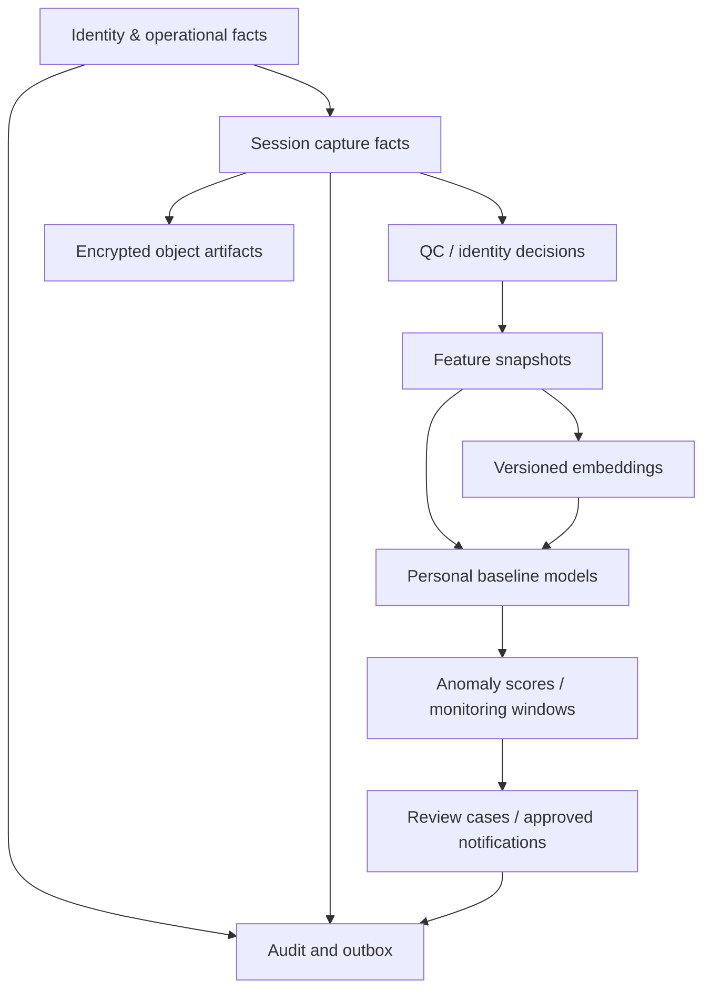

# Reflexion Platform v2：数据库与存储设计

> 状态：目标 schema 基线
> 日期：2026-07-22
> 数据平台：MongoDB Atlas + encrypted object storage + durable queue
> 设计重点：多租户隔离、session 可追溯、纵向基线、版本化向量与可审计复核

## 1. 设计原则

- MongoDB 保存业务事实、处理状态、结构化特征和派生结果；音视频和大型文件进入对象存储。
- 患者域 collection 的每份文档都带 `tenantId`；患者数据还带 `patientId`，且所有索引以 tenant 作为第一前缀。
- 不把患者嵌入用户文档，不保存重复映射集合，不在会话中内嵌无限增长事件数组。
- 原始 capture 事实 append-only；处理结果按 revision 新增，不覆盖上一版。
- 人脸身份向量与认知监控向量物理/逻辑分离，使用不同权限、保留策略和索引。
- embedding 只有在 `modelId + modelVersion + dimensions + normalization + featureSchemaVersion` 完全一致时才可比较。
- 业务状态使用普通 collection；只有高频、追加写、几乎不更新的 device telemetry 使用 time-series collection。
- 过期 pairing、幂等键、短期 operation 可用 TTL；临床/审计数据不得仅依赖 TTL 作为合规删除机制。

## 2. 数据分层



### Layer A：身份与运营事实

tenant、用户、患者、关系、enrollment、consent、设备、assignment、care plan。

### Layer B：采集事实

session、turn/event、artifact manifest、协议版本和设备上下文。

### Layer C：派生证据

QC、identity link、feature snapshot、embedding、assessment revision、baseline revision、anomaly score。

### Layer D：工作流和审计

review case、disposition、notification、processing run、outbox、audit。

## 3. Collection 目录

### 3.1 Identity 与 patient domain

| Collection | 关键字段 | 关键索引 |
|---|---|---|
| `tenants` | `_id`, name, status, region, policyVersion | `{status:1}` |
| `users` | `_id`, tenantId, authSubject, emailNormalized, roles[], status | unique `{tenantId:1, authSubject:1}`；partial unique email |
| `patients` | `_id`, tenantId, displayName, preferredLanguage, timezone, demographics, status, version | `{tenantId:1,_id:1}`；`{tenantId:1,status:1}` |
| `care_relationships` | tenantId, patientId, userId, relationshipType, scopes[], status, validFrom/To | unique active relationship；`{tenantId:1,userId:1,status:1}` |
| `program_enrollments` | tenantId, patientId, programId, protocolPolicy, enrolledAt, status | `{tenantId:1,patientId:1,status:1}` |
| `consents` | tenantId, patientId, purpose, documentVersion, status, signedAt, withdrawnAt | `{tenantId:1,patientId:1,purpose:1,status:1}` |

不要把年龄作为永久数字保存；优先保存受政策控制的 birth year/date 或 `ageBand`，展示和分析时按 capture date 计算，避免年龄随时间失真。

### 3.2 Device 与 pairing

| Collection | 关键字段 | 关键索引 |
|---|---|---|
| `devices` | `_id`, tenantId?, serialHash, hardwareRevision, softwareVersion, status, lastSeenAt | unique `serialHash`；`{tenantId:1,status:1}` |
| `device_pairings` | `_id`, deviceId, codeHash, codeHint, state, expiresAt, failedAttempts, claimedBy, claimedPatientId | TTL `{expiresAt:1}`；unique partial `{codeHash:1,state:1}` |
| `device_assignments` | tenantId, deviceId, patientId, assignmentType, status, assignedAt, revokedAt, version | unique partial active device；unique partial active primary patient |
| `device_credentials` | deviceId, credentialId, secretHash/keyRef, version, status, issuedAt, expiresAt, rotatedAt | unique `credentialId`；`{deviceId:1,status:1}` |
| `device_configurations` | deviceId, configVersion, desired, reported, effectiveAt | unique `{deviceId:1,configVersion:1}` |
| `device_telemetry` | `recordedAt`, `meta:{tenantId,deviceId,kind}`, measurements | time-series `timeField=recordedAt`, stable `metaField=meta` |

安全要求：

- `codeHash` 使用带服务端 pepper 的慢/防暴力 hash 或 HMAC；不保存可查询明文 pairing code。
- `secretHash`/`keyRef` 不可返回 API；如果使用非对称设备身份，优先保存 public key 和 attestation metadata。
- pairing claim、assignment 建立、旧 assignment revoke 和 exchange ticket 创建必须在一个短事务中完成。

### 3.3 Care plan 与日常助手

| Collection | 关键字段 | 关键索引 |
|---|---|---|
| `care_plans` | tenantId, patientId, version, status, effectiveFrom/To, ownerId | `{tenantId:1,patientId:1,status:1}` |
| `medication_plans` | tenantId, patientId, carePlanId, displayName, schedule, instructions, source, version, status | `{tenantId:1,patientId:1,status:1}` |
| `reminder_rules` | tenantId, patientId, type, recurrence, timezone, text, status | `{tenantId:1,patientId:1,status:1}` |
| `reminder_occurrences` | tenantId, patientId, ruleId/planId, scheduledAt, status, response, respondedAt | unique `{tenantId:1,sourceId:1,scheduledAt:1}`；timeline index |
| `caregiver_tasks` | tenantId, patientId, category, priority, status, sourceRef, dueAt | `{tenantId:1,assigneeId:1,status:1,dueAt:1}` |

药物计划保存 caregiver/provider 配置的事实；Agent 只能读取计划、确认 occurrence 或创建复核任务，不能自由写剂量和药名。

### 3.4 Session capture

| Collection | 关键字段 | 关键索引 |
|---|---|---|
| `sessions` | tenantId, patientId, deviceId, type, state, stateVersion, protocolContext, acquisition, consentRef, summary | unique `{tenantId:1,_id:1}`；patient timeline；device timeline |
| `session_events` | tenantId, patientId, sessionId, eventId, sequence, occurredAt, kind, actor, payload | unique `{sessionId:1,eventId:1}`；unique partial `{sessionId:1,sequence:1}` |
| `transcript_turns` | tenantId, patientId, sessionId, turnId, sequence, role, startedAt, endedAt, text, asr, redaction | unique `{sessionId:1,turnId:1}`；`{tenantId:1,patientId:1,startedAt:1}` |
| `artifacts` | tenantId, patientId, sessionId, clientArtifactId, kind, objectKey, hash, size, encryption, state, retentionClass | unique `{sessionId:1,clientArtifactId:1}`、unique `{sessionId:1,kind:1,hash:1}`；`{state:1,createdAt:1}` |
| `processing_runs` | tenantId, patientId, sessionId, stage, pipelineVersion, revision, state, attempts, timestamps, error | unique `{sessionId:1,stage:1,pipelineVersion:1,revision:1}` |

建议的 `sessions` 文档：

```json
{
  "_id": "ses_01...",
  "tenantId": "ten_01...",
  "patientId": "pat_01...",
  "deviceId": "dev_01...",
  "type": "daily_checkin",
  "state": "feature_pending",
  "stateVersion": 7,
  "createdAt": "2026-07-22T00:10:00Z",
  "localCompletedAt": "2026-07-22T00:14:12Z",
  "protocolContext": {
    "protocolId": "daily-checkin",
    "protocolVersion": "2.1.0",
    "promptVersion": "mirror-zh-v4",
    "toolPolicyVersion": "home-safe-v2",
    "featureSchemaVersion": "home-features-v3"
  },
  "consentRef": {
    "consentId": "con_01...",
    "purpose": "home_cognitive_monitoring",
    "version": "2026-04"
  },
  "acquisition": {
    "language": "zh-CN",
    "timezone": "Asia/Shanghai",
    "durationMs": 252000,
    "patientSpeechMs": 118000,
    "patientTurns": 12
  },
  "artifactCounts": { "audio": 1, "video": 1, "transcript": 1 },
  "latestProcessingRevision": 2,
  "createdBy": { "type": "device", "id": "dev_01..." }
}
```

`sessions` 不内嵌完整 transcript、frame 或所有处理输出，只保存小型摘要和当前引用。

### 3.5 QC、身份、特征和观察

| Collection | 关键字段 | 关键索引 |
|---|---|---|
| `quality_assessments` | tenantId, patientId, sessionId, revision, gate, scores, flags[], coverage, pipelineVersion | unique `{sessionId:1,revision:1}` |
| `identity_links` | tenantId, patientId, sessionId, revision, verdict, confidence, reasons[], enrollmentRef | unique `{sessionId:1,revision:1}` |
| `feature_snapshots` | tenantId, patientId, sessionId, capturedAt, schemaVersion, pipelineVersion, featureGroups, inclusion | unique `{sessionId:1,schemaVersion:1,pipelineVersion:1}`；patient timeline |
| `session_observations` | tenantId, patientId, sessionId, revision, observationState, findings[], uncertainty, modelTrace, reviewState | unique `{sessionId:1,revision:1}` |
| `feature_embeddings` | tenantId, patientId, sessionId, capturedAt, family, modelId/version, dimensions, vector, quality, inclusion | vector index + patient/model timeline |
| `identity_embeddings` | tenantId, patientId, enrollment/session ref, face model/version, dimensions, encrypted vector, status | 独立权限和 vector index |

`feature_snapshots` 是异常检测的主要可解释输入，保存标量和小型结构化向量；`feature_embeddings` 是同构模型空间中的补充输入。两者不可互相替代。

建议 feature group：

```json
{
  "speechAcoustic": {
    "speechRate": 2.73,
    "articulationRate": 3.18,
    "pauseRatio": 0.28,
    "meanPauseMs": 712,
    "responseLatencyMs": 1280,
    "pitchVariability": 0.19
  },
  "speechLanguage": {
    "lexicalDiversity": 0.43,
    "wordFindingMarkers": 4,
    "semanticCoherence": 0.71,
    "informationUnits": 11
  },
  "task": {
    "recallScore": 0.67,
    "orientationScore": 1.0,
    "instructionRepeats": 1,
    "supportPrompts": 2
  },
  "interaction": {
    "completionRatio": 1.0,
    "interruptionCount": 1,
    "caregiverSpeechRatio": 0.04
  }
}
```

所有字段必须由 feature registry 定义单位、合法范围、缺失语义、语言适用性和 extraction code hash；禁止用 `0` 表示“缺失”。

### 3.6 纵向、复核和通知

| Collection | 关键字段 | 关键索引 |
|---|---|---|
| `operational_baselines` | tenantId, patientId, baselineType=`reassurance_mvp`, state, sessionCount, window, metricAggregates, algorithmVersion, revision | unique active patient/type；patient revision timeline |
| `daily_statuses` | tenantId, patientId, localDate, timezone, completed, technicalState, operationalStatus, primaryReason, secondaryReasons[], finalizedAt, ruleVersion | unique `{tenantId:1,patientId:1,localDate:1}` |
| `away_periods` | tenantId, patientId, startsOn, endsOn, timezone, reason, createdBy, state | patient date-range index |
| `manual_flags` | tenantId, patientId, severity, reason, state, createdBy, createdAt, resolvedAt | active patient flag index |
| `baseline_models` | tenantId, patientId, baselineId, state, eligibility, feature/model versions, valid window, aggregates, revision | unique `{tenantId:1,patientId:1,baselineId:1,revision:1}`；one active partial |
| `anomaly_scores` | tenantId, patientId, sessionId, baselineRef, scoreVersion, components, overall, status, confidence, reasons | unique `{sessionId:1,baselineRevision:1,scoreVersion:1}`；timeline |
| `monitoring_windows` | tenantId, patientId, windowStart/End, baselineState, coverage, adherence, trend, persistence, status, action | unique `{tenantId:1,patientId:1,windowEnd:1,ruleVersion:1}` |
| `review_cases` | tenantId, patientId, sourceRefs[], reason, priority, state, assignedTo, SLA, currentDisposition | queue indexes |
| `review_dispositions` | tenantId, patientId, caseId, reviewerId, outcome, notes, labels[], createdAt | `{tenantId:1,caseId:1,createdAt:1}` |
| `notifications` | tenantId, patientId, recipientUserId, type, source, dedupeKey, state, createdAt/readAt | unique `{tenantId:1,recipientUserId:1,dedupeKey:1}`；`{tenantId:1,recipientUserId:1,state:1,createdAt:-1}` |
| `notification_suppressions` | tenantId, patientId, metricCode, status, acknowledgedAt, suppressUntil, sourceNotificationId | `{tenantId:1,patientId:1,metricCode:1,suppressUntil:1}` |

`operational_baselines/daily_statuses` 实现正式需求的 M1–M5 caregiver reassurance engine；`baseline_models/anomaly_scores/monitoring_windows` 属于更严格的研究/高级纵向层。两组 collection 不共享一个含混的 `riskScore`，也不允许高级研究分数未经 policy 直接覆盖 caregiver status。

### 3.7 Registry、outbox 和审计

| Collection | 用途 |
|---|---|
| `protocol_registry` | session protocol、版本、状态和签名 hash |
| `feature_registry` | 特征定义、单位、范围、语言/设备适用性、schema version |
| `model_registry` | model/embedding/scorer 版本、artifact hash、验证状态、allowed use |
| `rule_registry` | baseline、persistence、review/notification 规则版本 |
| `outbox_events` | 与业务事务原子写入的待发布事件 |
| `event_consumptions` | consumer 幂等去重和处理结果 |
| `audit_events` | append-only actor/action/object/outcome；单独 retention 和访问策略 |
| `idempotency_records` | actor + route + key + request hash + response ref；短 TTL |

## 4. 向量存储设计

### 4.1 不同 embedding family 分开

同一个 collection 可以存多个 family，但每个 family/model/dimension 使用独立的 versioned vector field 或独立 collection/index。首期更推荐独立 collection：

- `speech_acoustic_embeddings_v1`
- `speech_semantic_embeddings_v1`
- `conversation_task_embeddings_v1`
- `identity_face_embeddings_v1`（严格隔离）

原因：向量索引要求固定维度和 similarity；不同模型空间的余弦距离没有共同语义。模型升级时双写新 collection/index，验证后切读，不原地覆盖旧向量。

### 4.2 认知向量文档

```json
{
  "_id": "emb_01...",
  "tenantId": "ten_01...",
  "patientId": "pat_01...",
  "sessionId": "ses_01...",
  "capturedAt": "2026-07-22T00:14:12Z",
  "family": "speech_semantic",
  "model": {
    "id": "semantic-encoder",
    "version": "2026-06-15",
    "dimensions": 1024,
    "normalization": "l2",
    "inputLanguage": "zh-CN"
  },
  "featureSchemaVersion": "home-features-v3",
  "protocolVersion": "2.1.0",
  "vector": [0.012, -0.044],
  "quality": { "score": 0.91, "flags": [] },
  "inclusion": "include",
  "sourceHash": "sha256:...",
  "createdAt": "2026-07-22T00:20:00Z"
}
```

### 4.3 Atlas vector index

每个 index 至少包含：

- vector field：固定 `numDimensions`，通常使用 `cosine`（最终由模型验证决定）。
- filter fields：`tenantId`、`patientId`、`model.version`、`featureSchemaVersion`、`protocolVersion`、`capturedAt`、`inclusion`、`quality.score`。

向量查询必须先过滤 tenant、patient、同一模型版本、允许 inclusion 和时间窗。个人 baseline 通常只有几十到几百条 session，生产 anomaly scorer 应读取 baseline aggregate 或做 patient 内 exact distance；ANN 更适合 cohort/research 检索和大规模相似历史检索，不能因为 ANN 返回近邻就直接发告警。

MongoDB Vector Search 的向量字段要求固定维度并明确 similarity，也支持对已索引 metadata 做 pre-filter：<https://www.mongodb.com/docs/atlas/atlas-vector-search/vector-search-stage/>

## 5. Baseline 与 anomaly 文档

### 5.1 Baseline model

```json
{
  "_id": "base_01...",
  "tenantId": "ten_01...",
  "patientId": "pat_01...",
  "state": "active",
  "revision": 3,
  "eligibility": {
    "usableSessions": 18,
    "distinctDays": 16,
    "distinctWeeks": 5,
    "spanDays": 36,
    "qualityCoverage": 0.89
  },
  "inputVersions": {
    "featureSchemaVersion": "home-features-v3",
    "pipelineVersion": "feature-pipeline-2.0.0",
    "embeddingModels": ["semantic-encoder@2026-06-15"],
    "baselineAlgorithmVersion": "robust-personal-v1"
  },
  "validFrom": "2026-06-01T00:00:00Z",
  "validThrough": "2026-07-10T00:00:00Z",
  "scalarAggregates": {
    "speechRate": { "median": 2.71, "mad": 0.22, "n": 18 },
    "pauseRatio": { "median": 0.24, "mad": 0.04, "n": 18 }
  },
  "vectorAggregates": {
    "speechSemantic": {
      "centroidRef": "vecagg_01...",
      "cosineDistanceMedian": 0.11,
      "cosineDistanceMad": 0.03,
      "n": 17
    }
  },
  "excludedSessionIds": [],
  "createdAt": "2026-07-10T01:00:00Z"
}
```

### 5.2 Anomaly score

```json
{
  "_id": "ano_01...",
  "tenantId": "ten_01...",
  "patientId": "pat_01...",
  "sessionId": "ses_01...",
  "capturedAt": "2026-07-22T00:14:12Z",
  "baselineRef": { "id": "base_01...", "revision": 3 },
  "scoreVersion": "personal-anomaly-v1",
  "status": "watch",
  "overallScore": 0.63,
  "confidence": 0.82,
  "components": {
    "structuredDeviation": 0.68,
    "embeddingDeviation": 0.55,
    "trendChange": 0.61,
    "taskDeviation": 0.70,
    "qualityPenalty": 0.06
  },
  "persistence": { "rule": "2_of_3", "matched": 1, "window": 3 },
  "reasons": [
    { "code": "PAUSE_RATIO_ABOVE_PERSONAL_RANGE", "direction": "worse", "contribution": 0.24 }
  ],
  "reviewCaseId": null,
  "createdAt": "2026-07-22T00:24:00Z"
}
```

## 6. 数据不变量

1. 一个 active `device_assignment` 必须指向存在且 active 的 device 和 patient。
2. `daily_checkin` session 必须引用 capture 时有效的 monitoring consent；撤回后禁止创建新 session。
3. artifact 只有 hash/size/state 校验完成才能进入 `verified`。
4. feature snapshot 必须引用一个已完成 QC/identity gate 的 session revision。
5. anomaly score 必须引用确切 baseline revision 和 input model versions。
6. baseline 只能使用 `include` 或经算法明确支持的 `include_with_caveats`，绝不使用 `manual_review/exclude`。
7. review disposition append-only；当前 case 状态可以更新，但历史处置不覆盖。
8. caregiver-safe notification 必须引用 rule/reviewer 决策来源，不能直接引用原始 LLM 文本。

这些不变量由 service layer + schema validator + index/transaction 共同保证，不能只靠文档约定。

## 7. 索引基线

所有 patient timeline 查询遵循：

```javascript
{ tenantId: 1, patientId: 1, capturedAt: -1 }
```

推荐索引：

```javascript
// Sessions
{ tenantId: 1, patientId: 1, createdAt: -1 }
{ tenantId: 1, deviceId: 1, createdAt: -1 }
{ state: 1, updatedAt: 1 }

// Features and results
{ tenantId: 1, patientId: 1, capturedAt: -1, pipelineVersion: 1 }
{ tenantId: 1, patientId: 1, status: 1, capturedAt: -1 }

// Review work queue
{ tenantId: 1, state: 1, priority: -1, "sla.dueAt": 1 }

// Outbox dispatcher
{ state: 1, nextAttemptAt: 1, createdAt: 1 }
```

不要预先给每个字段建立索引。上线后按 query shape、`explain()`、读写比和 index size 调整；写多 collection 的每个额外索引都会增加写成本。

## 8. 保留、删除与冷热分层

保留策略由 `retentionClass` 决定，具体年限必须由 intended use、研究协议、合同和司法辖区共同批准，不能硬编码在产品逻辑中。

建议 class：

- `ephemeral_operational`：pairing、idempotency、一次性 ticket。
- `device_telemetry_short`：设备健康和非患者内容日志。
- `patient_interaction`：transcript、session event。
- `sensitive_biometric`：face enrollment/vector，最小化且独立撤回流程。
- `clinical_evidence`：QC、features、observations、review disposition。
- `immutable_audit`：安全/临床访问审计。

删除流程：

1. 创建 deletion request 和合法性/范围决策。
2. 阻止新的处理和导出。
3. 删除或 crypto-shred 对象 artifact。
4. 删除/去标识结构化数据和所有 vector index source document。
5. 使 baseline 失效并按剩余合法数据重建。
6. 写不含被删内容的 deletion audit proof。

## 9. 备份、恢复和区域

- Atlas 和对象存储放在与主要 API/worker 相同或合规允许的低延迟区域。
- 明确定义 pilot 和 production 的 RPO/RTO；恢复演练必须包含 Mongo、对象 manifest、队列和 model registry 的一致性。
- 对象存储开启版本控制/不可变策略时，要和数据主体删除要求协调，不能把备份保留当作“永不删除”。
- 研究导出只产生 versioned、去标识 dataset snapshot，不能直接在生产 collection 上训练。

## 10. 从当前集合到 v2 的映射

| 当前 | v2 目标 | 迁移备注 |
|---|---|---|
| `NursePatientConfig` caregiver 字段 | `users` | 邮箱规范化；新建 authSubject；不迁移明文 secret |
| `NursePatientConfig.patients[]` | `patients` | 每个 embedded `_id` 保持 legacy reference |
| caregiver-patient 嵌套关系 | `care_relationships` | 创建 active primary caregiver relationship |
| patient mirror 字段 | `devices` + `device_assignments` | 以 map 和 embedded 数据对账，冲突进入人工修复清单 |
| `MirrorPairingSessions` | `device_pairings` | 旧 token 不复制；已配对设备强制凭据轮换 |
| `MirrorIdToNurseIdMap` | `device_assignments` | 成功对账后只读归档 |
| `Conversation` | `sessions` + `transcript_turns` | `logs[]` 拆 turn；保留 legacyConversationId |
| `ConversationIdToPatientIdMap` | `sessions.patientId` | 映射只用于回填 |
| `DailyPatientStatus` | `monitoring_windows` + adherence read model | 旧红黄绿是完成状态，不当作认知风险迁移 |
| 本地 JSON feature/profile | 新 feature/baseline/result collections | mock embedding 和 synthetic point 不回填为证据 |

迁移全程采用新增、回填、dual-read、对账、切读、停止旧写、只读归档；不在首个迁移发布中删除旧集合。
