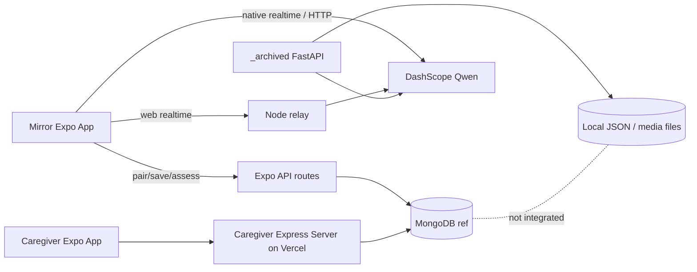
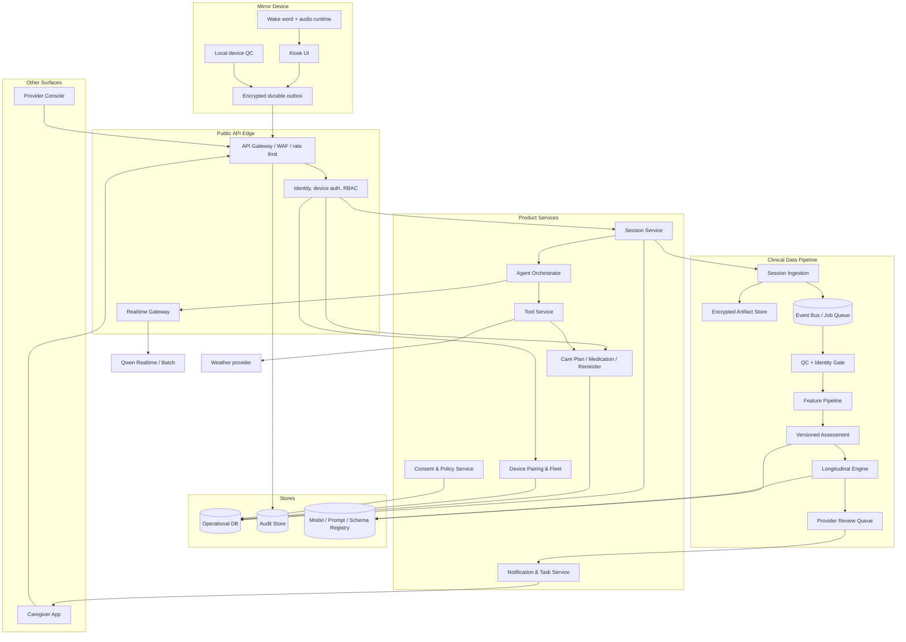
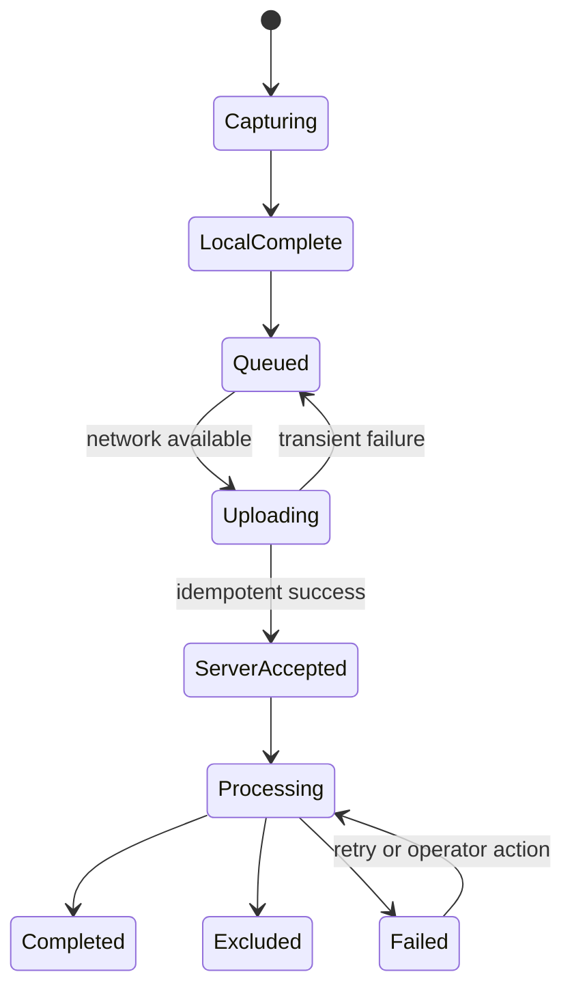

# Mirror App 目标系统架构

> 日期：2026-07-22
> 目标：把当前多个原型链路收敛为可测试、可审计、可纵向扩展的统一平台
> 详细设计：本文件保留产品级视图；API、数据库和异常检测的实现基线以 [Platform v2 API 与领域架构](../architecture/platform-v2-api-and-domain-architecture.md)、[Platform v2 数据库设计](../architecture/platform-v2-database-design.md) 和 [纵向监控与向量异常检测](../architecture/longitudinal-vector-anomaly-design.md) 为准。

## 1. 当前架构

当前存在三条主要后端路径：

1. `mirror-app/app/api/*`：Expo Router API 直接连接 MongoDB，负责配对、Qwen token、会话保存和 LLM 评估。
2. `reflexion-server`：Express + MongoDB，负责 caregiver 账号、患者、配对确认、会话查询、完成状态和摘要；已部署到 `https://reflexion-caregiver-app-server.vercel.app`，`/health` 已确认返回 200。
3. `_archived`：FastAPI + 文件存储，拥有更完整的 batch multimodal、identity、feature snapshot 和 longitudinal service，但没有接入前两条生产数据流。

实时对话又分为：

- Web → Node relay → Qwen；
- Native → Qwen realtime WebSocket；
- Native/Web → Qwen ASR + Chat + TTS 回合制降级。



这个拓扑适合快速试验，但职责重复、模型配置漂移、认证不一致，并且无法保证一条 session 从采集到纵向输出有唯一来源。

Caregiver App 已通过 `EXPO_PUBLIC_CAREGIVER_APP_BACKEND_URL` 指向上述 Vercel 服务。需要特别区分：caregiver 客户端会移除调用路径开头的 `/api`，而 mirror 的 `getApiUrl()` 会保留 `/api`；同时 reflexion-server 当前没有 `mirror-pairing/request-code`、`device-status`、`qwen-token`、`conversations` 或 `assess` 路由。因此该部署是可复用的生产起点，但尚不是 mirror 的可直接使用后台。

## 2. 目标原则

- Realtime Agent 负责体验与工具编排，不负责最终临床分类。
- 所有 session 先进入统一 ingestion contract，再进入 QC、identity、assessment 和 longitudinal 流程。
- Patient、caregiver、provider、device 使用不同主体和权限。
- 设备不直接连接 MongoDB，不持有长期 Qwen/API 密钥。
- 工具调用只能通过服务端 allowlist，模型不能直接执行任意网络或数据库操作。
- 原始记录不可被重算结果覆盖；模型运行使用 append-only result revision。
- companion 与 screening 在数据用途、保留策略和处理流程上明确区分。
- 离线同步采用 durable outbox + idempotent ingestion，而不是 UI 文案承诺。

## 3. 目标逻辑架构



## 4. 服务职责

### 4.1 API Gateway 与认证

- 校验 caregiver/provider access token；
- 校验 device credential、证书或设备签名；
- 执行租户和对象级授权；
- 请求大小、速率、IP/设备异常和重放保护；
- 生成 correlation ID 并写审计入口；
- WebSocket 凭据放在 header 或短期一次性 ticket 中，不放长期 token 到 query string。

### 4.2 Device Pairing & Fleet

- 创建短期一次性 pairing session；
- caregiver claim 时原子绑定 patient/device/tenant；
- 设备凭据轮换、撤销和恢复；
- 记录 app、OS、硬件、最后在线、健康和更新状态；
- 支持远程配置、灰度和 factory reset 审计。

### 4.3 Session Service

- 创建 `sessionId`、确定 `sessionType` 和 protocol；
- 校验 consent、care plan、语言、时区和设备状态；
- 返回短期 realtime ticket 和最小 patient context；
- 管理 `created → active → locally_completed → uploaded → processing → completed/excluded/failed` 状态机；
- 结束时接收 outbox manifest，保证幂等。

### 4.4 Agent Orchestrator

- 为 companion 和 screening 选择不同 prompt/policy；
- 注入经授权的姓名、语言、计划和可更正记忆；
- 统一三种 transport 的 persona、tool 和结束语义；
- 接收 Qwen tool call，只转给 allowlist Tool Service；
- 输出结构化对话事件而不是让各 hook 自行拼装不同 payload。

### 4.5 Tool Service

首期工具：

- `get_weather(location, date)`；
- `get_today_schedule(patient_id)`；
- `create_reminder(type, local_time, recurrence, text)`；
- `get_medication_occurrences(patient_id, date)`；
- `record_medication_response(occurrence_id, status)`；
- `create_caregiver_task(category, urgency, summary)`。

每个工具必须定义 JSON schema、权限、幂等键、超时、重试、副作用确认和审计字段。药物工具只能操作已配置 plan/occurrence，不接受模型自由生成剂量。

### 4.6 Session Ingestion 与 Artifact Store

- 使用统一 `SessionRecord` 接收 transcript、timing、QC 和 artifact manifest；
- 大媒体使用预签名分片上传，不进入 JSON body；
- 对 artifact 计算 hash、加密、病毒/格式检查并绑定 session；
- 原始媒体、抽帧、转录和派生特征分开存储与授权；
- 同意撤回后执行可验证的删除或隔离流程。

### 4.7 QC 与 Identity Gate

门控至少包含：

- 同意有效；
- patient-device 绑定有效；
- 目标说话人/目标人物可信；
- 语言与 protocol 匹配；
- 有效患者语音时长、轮次和任务覆盖；
- ASR、噪声、回声、摄像头遮挡和多人干扰；
- 急性不适、听力问题或 caregiver 代答等混杂标记。

门控结果：`include / include_with_caveats / repeat / exclude / manual_review`。

### 4.8 Feature、Assessment 与 Longitudinal

- Feature pipeline 把会话转为版本化 snapshot，不直接依赖 UI 临时字段。
- Assessment 保存事实特征、会话内观察、不确定性、输入覆盖和 model trace。
- Longitudinal 只聚合通过 gate 的 snapshot，计算 baseline completeness、偏离、趋势、波动、依从性和覆盖。
- Risk/alert 阈值是版本化规则；输出应允许 `insufficient_data`。
- Provider review 写回最终处置和标签，供后续验证和模型评价使用。

### 4.9 Notification & Task

- 镜面本地提醒和 caregiver push 使用同一 occurrence/task 主键；
- 支持偏好、免打扰、语言、重试、已读和深链；
- 风险提醒与普通运营通知分开；
- 没有 provider 审批的研究风险不得直接转换为患者诊断措辞。

## 5. 核心数据契约

### 5.1 建议实体

| 实体 | 关键字段 |
|---|---|
| `UserAccount` | subjectId, tenantId, roles, status, authProvider |
| `PatientEnrollment` | patientId, programId, language, timezone, status |
| `Device` | deviceId, patientId, credentialVersion, appVersion, health, revokedAt |
| `ConsentRecord` | consentId, patientId, purpose, version, status, signedAt, withdrawnAt |
| `CarePlan` | carePlanId, patientId, owner, version, effectivePeriod |
| `MedicationPlan` | medicationId, displayName, schedule, instructions, source, status |
| `ReminderOccurrence` | occurrenceId, planId, scheduledAt, response, respondedAt, idempotencyKey |
| `ConversationSession` | sessionId, type, lifecycle, protocolVersion, contextRefs |
| `Artifact` | artifactId, sessionId, kind, uri, hash, encryptionKeyRef, retentionClass |
| `SessionObservation` | sessionId, facts, QC, identity, usability, processingRevision |
| `FeatureSnapshot` | snapshotId, sessionId, pipelineVersion, features, inclusion |
| `LongitudinalWindow` | patientId, baselineState, coverage, deviation, trend, action, ruleVersion |
| `ReviewCase` | caseId, reason, priority, evidenceRefs, reviewer, disposition |
| `CaregiverTask` | taskId, patientId, category, status, dueAt, sourceRef |
| `AuditEvent` | actor, action, object, timestamp, correlationId, outcome |

### 5.2 Session envelope

仓库已有 `_archived/schemas/session-record.schema.json`，可作为起点，但需要：

- 加入 `sessionType: companion | screening`；
- 加入 lifecycle、idempotency、processing revision；
- 区分 consent purpose；
- 增加 prompt/protocol/provider trace；
- 增加 medication/reminder/tool event references；
- 统一 camelCase/snake_case 和枚举；
- 使用自动生成 TypeScript/Python 类型并在 API 边界验证。

### 5.3 评估结果

建议取消 patient-facing `screening_classification: dementia`，拆为：

```json
{
  "sessionUsability": "usable_with_caveats",
  "observationState": "change_to_review",
  "confidenceState": "limited",
  "observations": [],
  "qualityFlags": [],
  "featureSnapshotId": "...",
  "modelTrace": {
    "model": "...",
    "modelVersion": "...",
    "promptVersion": "...",
    "schemaVersion": "..."
  },
  "reviewState": "pending"
}
```

疾病类别只能作为研究/临床 reviewer 的受控字段，并与参考标签和 intended use 分开。

## 6. 端到端数据流

### 6.1 日常工具请求

1. Device 以短期 ticket 连接 Realtime Gateway。
2. Agent 识别 tool intent 并产生 schema-valid call。
3. Tool Service 根据 patient/role/policy 授权。
4. 读操作直接返回；写操作要求确认并使用 idempotency key。
5. Agent 口语化响应；工具事件写入 audit 和 session event，不默认进入认知评估。

### 6.2 Screening

1. Session Service 建立 screening session 并冻结版本。
2. Device 先写本地 outbox，再开始 realtime。
3. 每个 turn 增量落盘；结束时上传 manifest 和 artifacts。
4. Ingestion 校验并发布 `session.completed`。
5. QC/Identity gate 发布 inclusion verdict。
6. Feature → Assessment → Longitudinal 顺序处理，每一步都有 revision 和状态。
7. 变化规则触发 review case；review 后生成 caregiver-safe message。

### 6.3 离线同步



本地 outbox 需使用加密数据库或文件 + manifest；`AsyncStorage` 只适合低敏配置，不应承载长期 token、完整 transcript 或大量待上传媒体。

## 7. 安全架构

### 7.1 身份与授权

- Caregiver/provider：OIDC 或等价 token，会话刷新与撤销；服务端 RBAC + patient-level relationship check。
- Device：安装注册密钥或证书，绑定后轮换；短期 realtime/上传 ticket。
- Service-to-service：工作负载身份与最小权限。
- 每个读取和修改请求都从 token subject 推导权限，不信任 body/query 中的 `nurseId`。

### 7.2 密钥与数据

- 长期 Qwen key 只在服务端 secret manager。
- 设备 auth material 存 OS secure storage；服务端只存 hash 或可安全验证的凭据形式。
- TLS 全链路；对象存储使用 per-object encryption context。
- 日志默认脱敏，不记录 WebSocket token、transcript、配对码或人脸数据。
- Qwen 处理路径需要明确区域、保留政策、数据处理协议和 consent purpose。

### 7.3 API 防护

- 配对、登录、token mint、评估、上传和摘要分别限流；
- 全部 payload schema 校验、长度限制和枚举限制；
- 图片/音频不接受任意远程 URL，避免 SSRF；
- LLM JSON 输出必须再做 schema/value validation；
- 防止 prompt injection 通过 transcript 获得工具越权。

## 8. 部署建议

### 8.1 MVP 收敛方案

- 保留 Expo mirror/caregiver 客户端。
- 以已部署的 reflexion-server 为起点，或在同一网关后增加正式 mirror service；最终由一个稳定 API 域暴露认证、配对、session、plan、tools 和 caregiver API。
- 统一 `/api` 前缀约定，再把 mirror 的 `EXPO_PUBLIC_API_BASE` 指向正式网关；在此之前不要直接指向当前 caregiver URL。
- Realtime Gateway 作为独立 WebSocket 服务。
- 将 `_archived` 的 QC/identity/feature/longitudinal 逻辑改为消费统一 session event，并迁移到共享数据库/对象存储。
- 停止由 Expo Router API 直接承担生产 MongoDB 和临床评估职责。

### 8.2 环境

- `dev`：允许 mock provider，测试数据与真实数据隔离。
- `staging/validation`：固定 schema/model/prompt，可做受控 pilot 演练。
- `production/research`：签名版本、强制认证、审计、备份与事件响应。
- 后续 regulated release：锁定模型和配置，变更必须审批。

## 9. 可观测性

必须监控：

- pairing 成功率、失败原因和暴力尝试；
- wake detection、误唤醒/漏唤醒、会话启动延迟；
- ASR、首音、turn latency、回声、断连和 fallback；
- tool success/timeout/denied；
- outbox backlog、上传延迟、重复率；
- QC pass、identity inclusion、assessment failure；
- baseline coverage、review backlog、notification delivery；
- 按 app/model/prompt/device/language 分层的错误与性能。

观测事件不应默认携带原始健康内容。

## 10. 迁移策略

1. 冻结现有 Mongo `Conversation` 写入格式，增加 adapter 而不是立即破坏 caregiver 查询。
2. 新增统一 `SessionRecord v1`，镜面端双写一段时间。
3. 将 assessment 从镜面 Expo API 移到异步 pipeline。
4. 把 Python longitudinal service 改为从 session/snapshot store 读取，不再依赖本地 JSON。
5. caregiver 新接口优先读取新模型；旧的 completion trend 保留为 fallback。
6. 数据核对完成后停止旧的 Expo API 和直接 client assessment 路径。
